# 🥋 Z NIM NIE ROBIĘ

<p align="center">
  
</p>

<p align="center">
  <b>Inteligentna aplikacja treningowa do prowadzenia sparingów i zadaniówek BJJ.</b><br/>
  Automatyczny dobór par · Duże timery · Rotacja w trójkach · Czytelny podgląd z dystansu
</p>

<p align="center">
  
  
  
  
</p>

<p align="center">
  <a href="https://znimnierobie.pl"><b>▶ Wypróbuj wersję webową</b></a>
</p>

---

## Czym jest ta aplikacja?

**Z NIM NIE ROBIĘ** to narzędzie dla trenerów BJJ i grapplingu, którzy prowadzą treningi z tabletem ustawionym na ścianie lub przy macie. Zamiast kartek, stopera i ręcznego ustawiania par — jedno urządzenie robi wszystko:

- **automatycznie dobiera pary** na podstawie wagi, poziomu i stroju (GI / NO-GI),
- **pilnuje timerów** z sygnałami dźwiękowymi na przygotowanie, pracę i przerwę,
- **rotuje trójki** z czytelnym podziałem na walczących i odpoczywającego,
- **wyświetla wszystko czytelnie** — nawet z kilku metrów na dużym ekranie.

Aplikacja działa offline, nie wymaga konta ani logowania. Dane zawodników są zapisywane lokalnie na urządzeniu.

---

## Zrzuty ekranu

### Ekran startowy

Pusty ekran konfiguracji — dodawanie zawodników, ustawianie czasu rund, przygotowania i przerw.

<p align="center">
  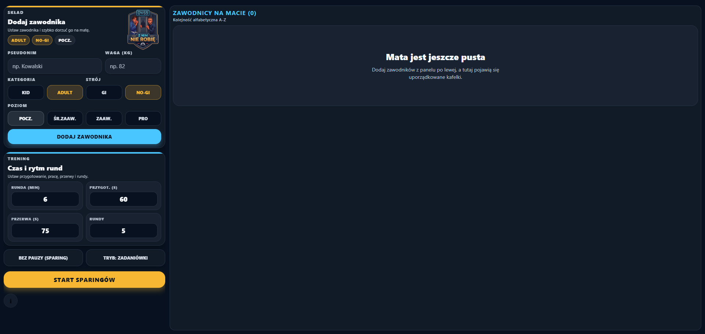
</p>

### Skład zawodników

26 zawodników na macie — każdy z kategorią (KID / ADULT), strojem (GI / NO-GI), wagą i poziomem zaawansowania. Kafelki można edytować dotknięciem.

<p align="center">
  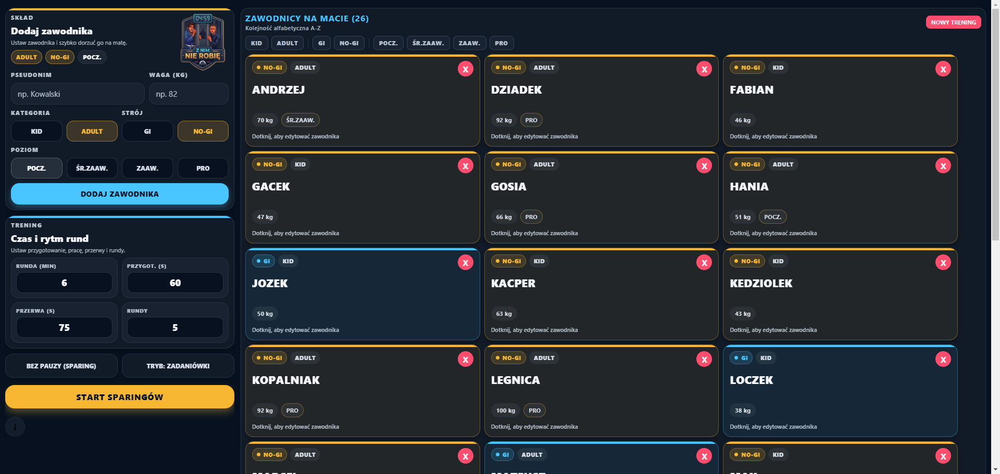
</p>

### Tryb zadaniówek

Po włączeniu trybu zadaniówek pojawiają się opcje: trójki lub dwójki. Przycisk startu zmienia się odpowiednio.

<p align="center">
  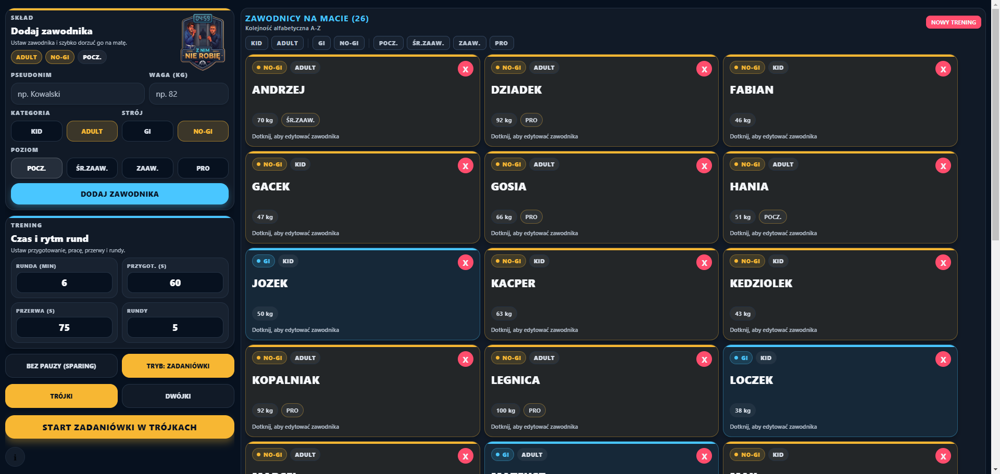
</p>

### Zawodnicy bez pauzy

Modal pozwalający oznaczyć zawodników, którzy nie odpoczywają między rundami (np. trener, najbardziej zaawansowani). System pomija ich przy rotacji pauz.

<p align="center">
  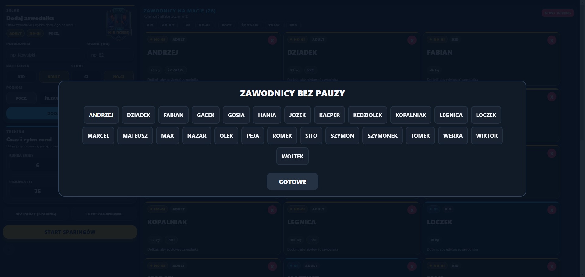
</p>

### Sparingi — przygotowanie

Faza przygotowania: siatka par podzielona na sekcje KID, ADULT i MIESZANE. Timer odlicza czas na rozejście się na pozycje. Pary dobrane automatycznie przez silnik matchmakera.

<p align="center">
  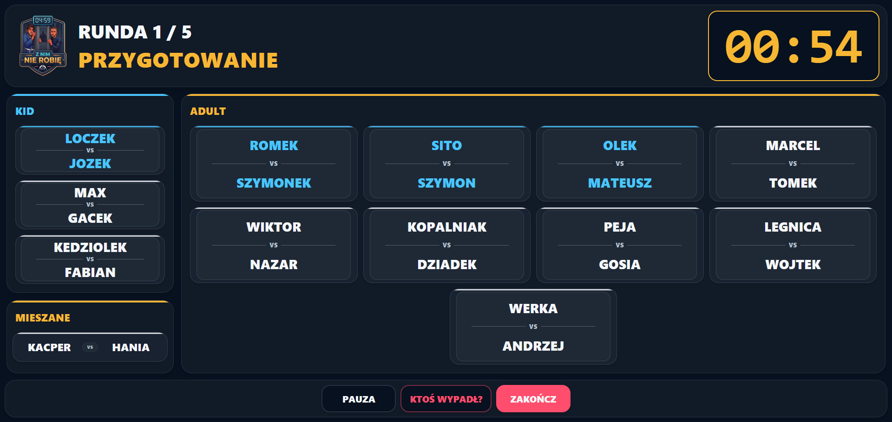
</p>

### Sparingi — timer pracy

Duży, czytelny timer widoczny z dystansu. Numer rundy na górze. Pauza i zakończenie na dole.

<p align="center">
  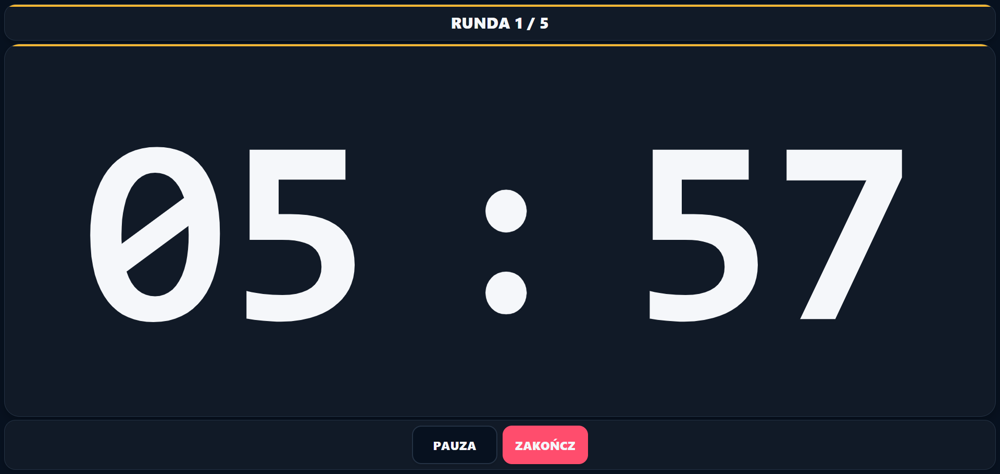
</p>

### Ktoś wypadł z treningu

W dowolnym momencie treningu można oznaczyć zawodników, którzy wypadli (kontuzja, zmęczenie). System przebudowuje pary na żywo bez konieczności restartowania treningu.

<p align="center">
  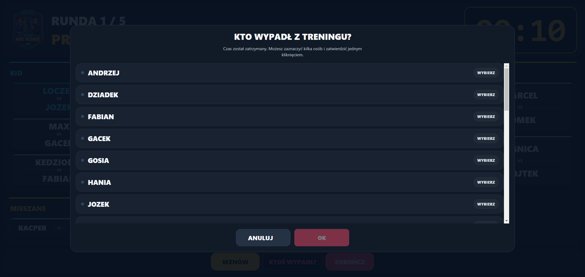
</p>

### Zadaniówki w trójkach — przygotowanie

Siatka trójek z podziałem na role: **[A] DÓŁ**, **[B] GÓRA**, **[C] PAUZA**. Widać kto walczy i kto odpoczywa. Sekcje KID i ADULT wyświetlane obok siebie.

<p align="center">
  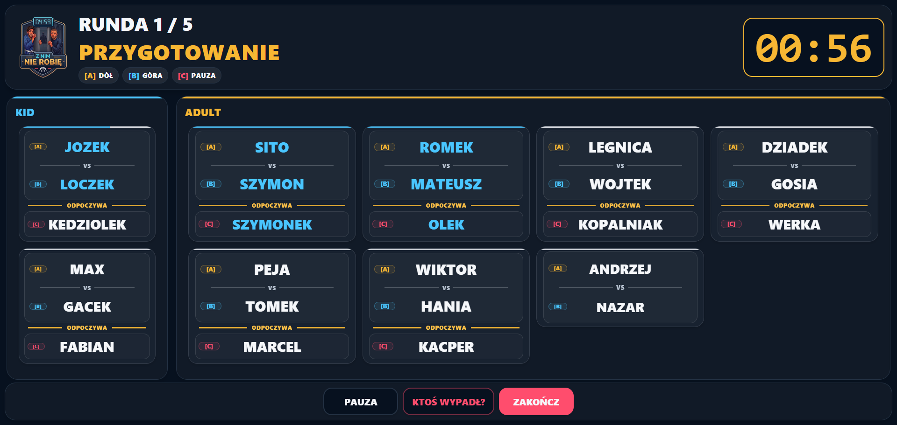
</p>

### Zadaniówki w trójkach — timer

Timer pracy z informacją o aktualnym etapie rotacji (np. etap 1/6). Pod timerem widać kto teraz walczy, kto odpoczywa i jaka będzie następna zmiana.

<p align="center">
  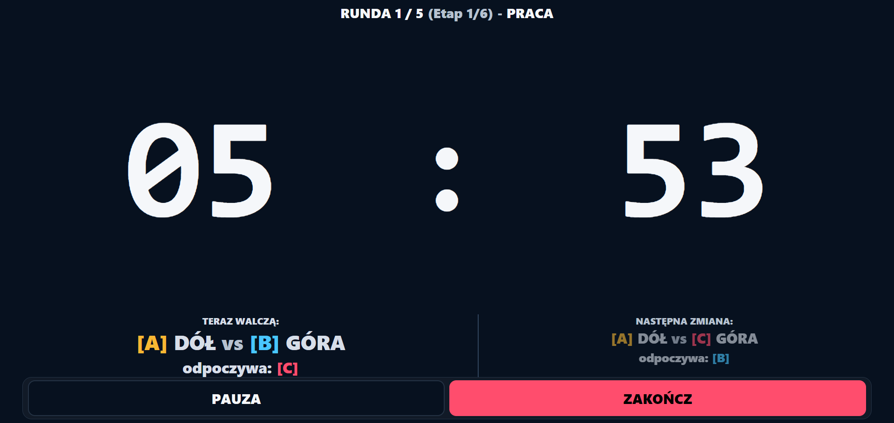
</p>

### Zadaniówki w dwójkach — przygotowanie

Pary A vs B w czytelnej siatce. Role [A] i [B] zamieniają się po każdym etapie. Układ identyczny jak w trójkach, ale bez strefy odpoczynku.

<p align="center">
  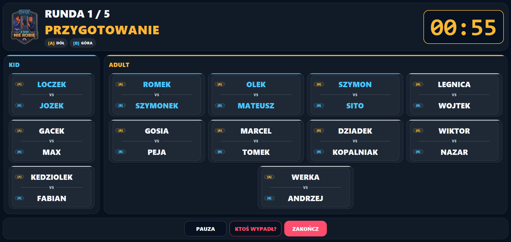
</p>

### Zadaniówki w dwójkach — timer

Timer z etapem 1/2. Informacja o aktualnych rolach i nadchodzącej zamianie.

<p align="center">
  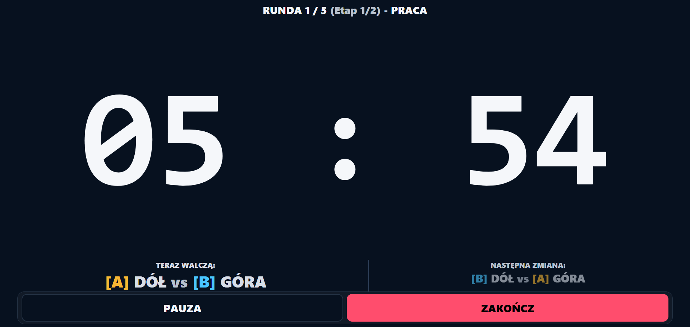
</p>

---

## Tryby treningowe

### ⚔️ Sparingi

Klasyczny tryb sparingowy. Cykl każdej rundy:

1. **Przygotowanie** — wyświetlenie par, czas na rozejście się na pozycje
2. **Praca** — duży timer, walka
3. **Przerwa** — odpoczynek, system generuje nowe pary na kolejną rundę

System pamięta historię spotkań i dba o to, żeby zawodnicy nie powtarzali tych samych par. Podział na sekcje KID, ADULT i MIESZANE (gdy wymaga tego liczebność grupy).

### 🔄 Zadaniówki w trójkach

Trzy osoby w grupie, sześć etapów na rundę — pełna rotacja. W każdym etapie dwóch walczy, trzeci odpoczywa:

| Etap | [A] DÓŁ | [B] GÓRA | [C] PAUZA |
|:----:|:--------:|:--------:|:---------:|
| 1 | Osoba 1 | Osoba 2 | Osoba 3 |
| 2 | Osoba 1 | Osoba 3 | Osoba 2 |
| 3 | Osoba 2 | Osoba 1 | Osoba 3 |
| 4 | Osoba 2 | Osoba 3 | Osoba 1 |
| 5 | Osoba 3 | Osoba 1 | Osoba 2 |
| 6 | Osoba 3 | Osoba 2 | Osoba 1 |

Po 6 etapach każdy walczył z każdym z obu pozycji. Czas etapu = czas rundy ÷ 6.

### 👥 Zadaniówki w dwójkach

Proste pary A vs B — dwa etapy na rundę. Po pierwszym etapie role się zamieniają (kto był na dole, idzie na górę). Czas etapu = czas rundy ÷ 2.

---

## Silnik doboru par (Matchmaker)

Matchmaker **nie losuje** — dobiera pary algorytmicznie według priorytetów:

| Priorytet | Kryterium |
|:---------:|-----------|
| 1 | **Unikaj powtórek** — nowe pary mają pierwszeństwo, system pamięta historię spotkań |
| 2 | **Strój** — GI walczy z GI, NO-GI z NO-GI (gdy brak opcji, strój jest pomijany) |
| 3 | **Poziom** — zbliżony poziom umiejętności (POCZ / ŚR.ZAAW / ZAAW / PRO) |
| 4 | **Waga** — zbliżona masa ciała |
| 5 | **Rotacja pauz** — sprawiedliwy podział kto odpoczywa (przy nieparzystej liczbie) |
| 6 | **Pary mieszane** — KID + ADULT tylko gdy wymaga tego liczebność grupy |

Gdy matematycznie nie da się uniknąć powtórki, system wybiera parę, która nie walczyła ze sobą najdłużej.

---

## Główne funkcje

- **Zarządzanie składem** — dodawanie, edycja i usuwanie zawodników z kafelkowego widoku
- **Kategorie** — podział na KID i ADULT z osobnym matchmakingiem
- **Strój** — obsługa GI i NO-GI z priorytetem zgodności stroju
- **Poziomy** — POCZ., ŚR.ZAAW., ZAAW., PRO
- **Timer** — duży, czytelny zegar widoczny z kilku metrów
- **Sygnały dźwiękowe** — gong na start pracy, sygnał 10 sekund przed końcem, gong na przerwę
- **Bez pauzy** — możliwość oznaczenia zawodników, którzy nie odpoczywają
- **Ktoś wypadł** — usunięcie zawodnika w trakcie treningu z automatycznym przeliczeniem par
- **Responsywny układ** — zoptymalizowany pod tablety 10.5", ale działa też na telefonach i w przeglądarce
- **Offline** — brak konta, brak backendu, dane zapisywane lokalnie (AsyncStorage)

---

## Stack technologiczny

| Warstwa | Technologia |
|---------|-------------|
| Framework | [Expo](https://expo.dev/) + React Native |
| Język | TypeScript |
| Routing | Expo Router |
| Dane lokalne | AsyncStorage |
| Audio | expo-av |
| Build | EAS Build |
| Web | Netlify |
| Target | Android (tablet 10.5"), iOS, przeglądarka |

---

## Struktura projektu

```
app/
  (tabs)/
    index.tsx              # Główny UI — ekrany, timery, siatki par
    engine/
      matchmaker.ts        # Silnik doboru par i rotacji
    types.ts               # Typy domenowe (RealPlayer, Match itp.)
assets/
  *.mp3                    # Dźwięki treningowe (gong, sygnał, brawa)
  images/                  # Ikony i splash screen
docs/
  screenshots/             # Zrzuty ekranu
```

---

## Uruchomienie

```bash
# Instalacja zależności
npm install

# Serwer deweloperski
npx expo start

# Build APK (Android, do testów)
eas build --platform android --profile preview

# Build produkcyjny (Android)
eas build --platform android --profile production

# Export wersji webowej
npx expo export --platform web
```

---

## Wersja webowa

Aplikacja jest dostępna online pod adresem:

**https://znimnierobie.pl**

Wersja webowa działa w przeglądarce na komputerze, tablecie i telefonie. Nie wymaga instalacji.

---

## Prywatność

- Nie wymaga konta ani logowania
- Nie wysyła danych do zewnętrznych serwerów
- Nie korzysta z analityki ani trackerów
- Dane zawodników przechowywane wyłącznie lokalnie na urządzeniu

---

## Licencja

Wszelkie prawa zastrzeżone. Kod źródłowy udostępniony wyłącznie w celach przeglądowych.

---

<p align="center">
  <b>Z NIM NIE ROBIĘ</b> · Aplikacja treningowa BJJ<br/>
  Zbudowane z 🥋 na macie i przy klawiaturze
</p>
