# 🥋 Z NIM NIE ROBIĘ

<p align="center">
  
</p>

<p align="center">
  <b>Inteligentna aplikacja treningowa do prowadzenia sparingów, zadaniówek i drilli BJJ.</b><br/>
  Automatyczny dobór par · Duże timery · Rotacja w trójkach · Czytelny podgląd z dystansu
</p>

<p align="center">
  
  
  
  
  
</p>

<p align="center">
  <a href="https://znimnierobie.pl"><b>▶ Wypróbuj wersję webową</b></a>
</p>

---

## Spis treści

- [Co nowego w v2.0.0 Beta](#co-nowego-w-v200-beta)
- [O aplikacji](#o-aplikacji)
- [Zrzuty ekranu](#zrzuty-ekranu)
- [Tryby treningowe](#tryby-treningowe)
- [Silnik doboru par (Matchmaker)](#silnik-doboru-par-matchmaker)
- [Główne funkcje](#główne-funkcje)
- [Stack technologiczny](#stack-technologiczny)
- [Struktura projektu](#struktura-projektu)
- [Uruchomienie](#uruchomienie)
- [Wersja webowa](#wersja-webowa)
- [Prywatność](#prywatność)
- [Licencja](#licencja)

---

## Co nowego w v2.0.0 Beta

- **Ekran startowy z wyborem języka** — PL / EN / PT (BR) widoczne od pierwszego uruchomienia
- **Trzy tryby treningowe** — SPARINGI · ZADANIÓWKI (TRÓJKI / DWÓJKI) · **DRILLE** (nowość, pełnoprawny tryb z parami stałymi i rotacją ról A/B co rundę)
- **Pole płeć (M / K)** w karcie zawodnika oraz **Walki wg płci** w opcjach sparingów (WYŁ / PRIORYTET / ZAWSZE)
- **Suwak Priorytet doboru** UMIEJĘTNOŚCI ↔ WAGA (4 snapy)
- **Podział wagowy** — opcjonalne dzielenie maty na dwie grupy wagowe
- **Kolejność walk** — ZBLIŻONE / RÓŻNE / LOSOWO
- **Bez pauzy (VIP)** w nowym, czytelnym układzie pigułek z imionami zawodników
- **Ktoś wypadł** w trakcie treningu — pauza, zaznaczenie kilku osób, jedno zatwierdzenie
- **Ekran końcowy „DZIĘKUJĘ — DOBRA ROBOTA!"** z powrotem do menu
- **Panel WERSJA V2** — kontakt, link do GitHuba i sklepu, krótki opis
- **Zoptymalizowane karty trójek i dwójek** pod tablety 10.5" — bez przewijania na typowych rozdzielczościach

---

## O aplikacji

**Z NIM NIE ROBIĘ** to narzędzie dla trenerów BJJ i grapplingu, którzy prowadzą treningi z tabletem ustawionym na ścianie lub przy macie. Zamiast kartek, stopera i ręcznego ustawiania par — jedno urządzenie robi wszystko:

- **automatycznie dobiera pary** na podstawie wagi, poziomu, stroju (GI / NO-GI) i płci,
- **pilnuje timerów** z sygnałami dźwiękowymi na przygotowanie, pracę i przerwę,
- **rotuje trójki i dwójki** w zadaniówkach z czytelnym podziałem na walczących i odpoczywającego,
- **prowadzi drille** z parami dobieranymi raz na cały trening i zamianą ról A/B co rundę,
- **wyświetla wszystko czytelnie** — duże fonty, mocny kontrast, czytelność z kilku metrów,
- **mówi po polsku, angielsku i portugalsku (BR)**.

Aplikacja działa offline, nie wymaga konta ani logowania. Dane zawodników zapisywane są lokalnie na urządzeniu.

---

## Zrzuty ekranu

### Wybór języka

Pierwsze uruchomienie — szybki wybór wersji językowej. Aplikację można w dowolnej chwili przełączyć między **PL / EN / PT** z dolnego paska.

<p align="center">
  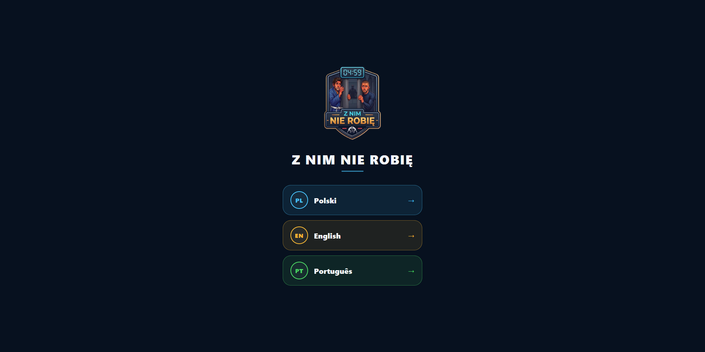
</p>

### Ekran startowy (pusta mata)

Konfiguracja treningu: dodawanie zawodników (lewy panel), czas i rytm rund, wybór trybu treningowego oraz opcji matchmakera. Po prawej miejsce na kafelki zawodników.

<p align="center">
  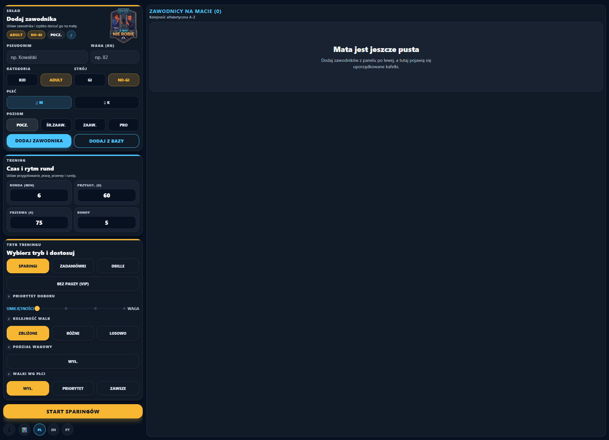
</p>

### Edycja zawodnika

Pełna karta zawodnika: pseudonim, waga, kategoria (KID / ADULT), strój (GI / NO-GI), płeć (M / K) i poziom (POCZ. / ŚR.ZAAW. / ZAAW. / PRO). Dotknięcie kafelka otwiera tę samą formę do edycji.

<p align="center">
  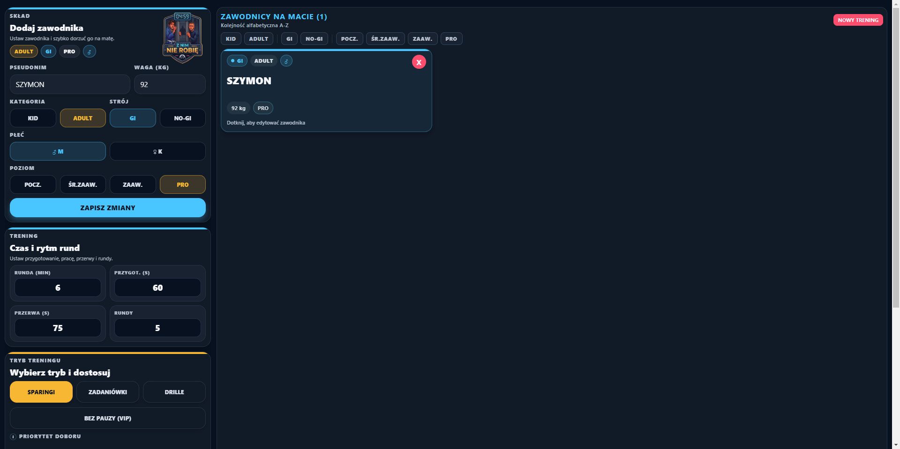
</p>

### Baza klubowa — wyszukiwanie

Modal **BAZA KLUBOWA** z listą zapamiętanych zawodników. Wyszukiwarka po imieniu, dodawanie pojedynczo przyciskiem **WYBIERZ**.

<p align="center">
  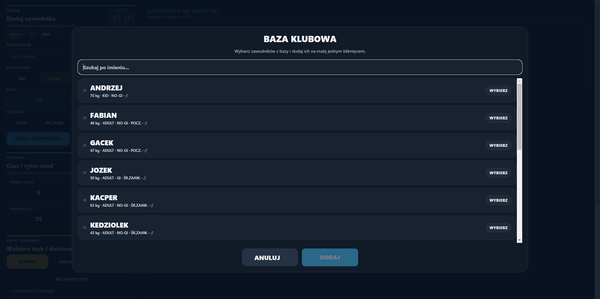
</p>

### Baza klubowa — wsadowe dodawanie

Zaznaczenie wielu osób naraz i dorzucenie ich na matę jednym kliknięciem **DODAJ (n)**. Kafelki podświetlają się na niebiesko.

<p align="center">
  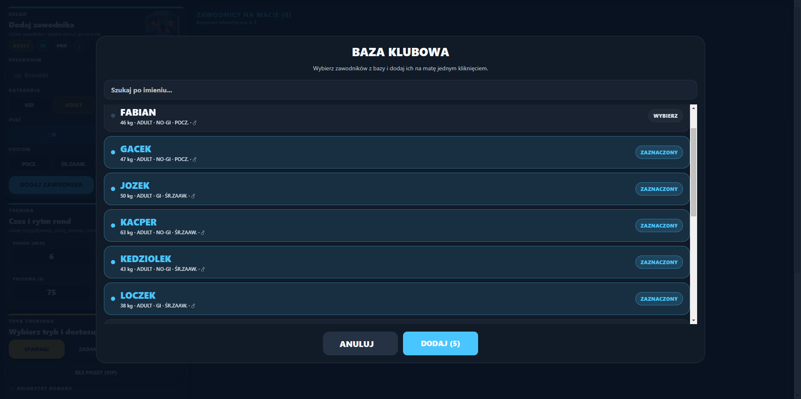
</p>

### Skład zawodników na macie

Zawodnicy posegregowani alfabetycznie z filtrami u góry (KID / ADULT / GI / NO-GI / poziom). Każda karta pokazuje strój, kategorię, płeć, wagę i poziom. Czerwony „×" usuwa, dotknięcie edytuje.

<p align="center">
  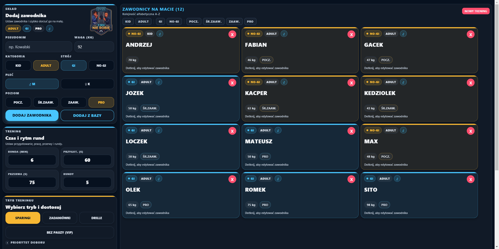
</p>

### Tryb SPARINGI

Klasyczny sparing z pełnym panelem opcji: **BEZ PAUZY (VIP)**, **PRIORYTET DOBORU** (suwak UMIEJĘTNOŚCI ↔ WAGA), **KOLEJNOŚĆ WALK** (ZBLIŻONE / RÓŻNE / LOSOWO), **PODZIAŁ WAGOWY** oraz **WALKI WG PŁCI** (WYŁ / PRIORYTET / ZAWSZE).

<p align="center">
  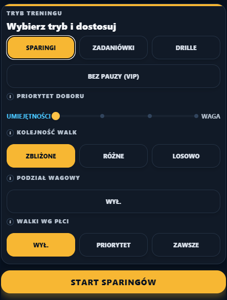
</p>

### Tryb ZADANIÓWKI (trójki / dwójki)

Po wybraniu zadaniówek pojawia się przełącznik **TRÓJKI / DWÓJKI**. Etykieta przycisku startu zmienia się odpowiednio (`START ZADANIÓWEK (TRÓJKI)` / `(DWÓJKI)`).

<p align="center">
  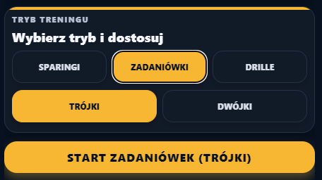
</p>

### Tryb DRILLE

Pary dobierane **raz na cały trening**, role A/B zamieniają się co rundę. Idealne do powtarzania techniki z tym samym partnerem.

<p align="center">
  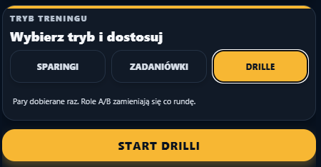
</p>

### Sparingi — przygotowanie

Faza **PRZYGOTOWANIE** rundy 1/5: siatka par podzielona na sekcje **KID**, **ADULT** i **MIESZANE**. Timer odlicza czas na rozejście się na pozycje. Pary dobrane przez silnik matchmakera.

<p align="center">
  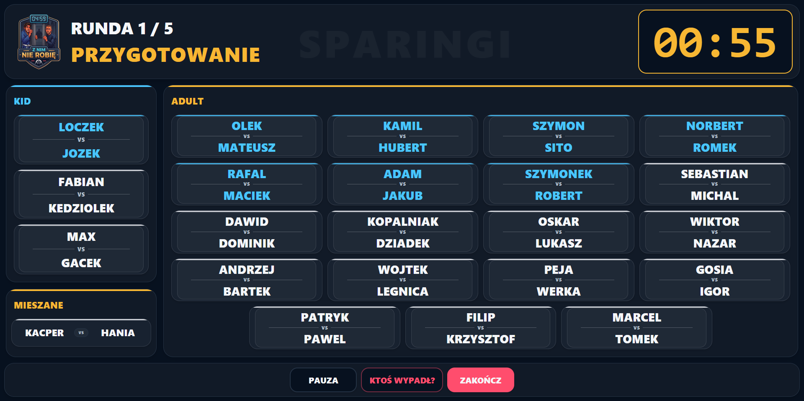
</p>

### Sparingi — timer pracy

Duży, czytelny timer widoczny z dystansu. Numer rundy na górze. Przyciski **PAUZA** i **ZAKOŃCZ** pod ręką.

<p align="center">
  
</p>

### Sparingi — przerwa i nowe pary

Faza **PRZERWA** rundy 2/5: na ekranie już widać nowy układ par dobrany na kolejną rundę. Trener może omówić co poprawić zanim padnie gong.

<p align="center">
  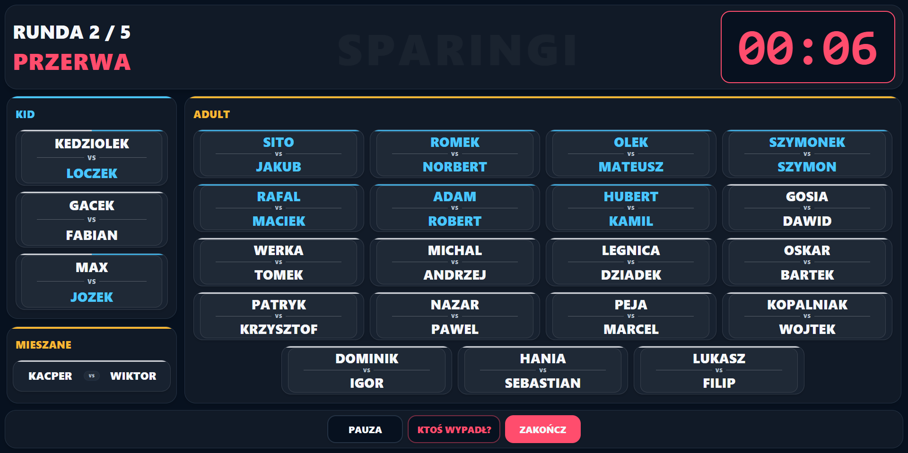
</p>

### Zadaniówki w trójkach — przygotowanie

Siatka trójek z podziałem na role: **[A] DÓŁ**, **[B] GÓRA**, **[C] PAUZA / ASYSTA**. Sekcje KID i ADULT obok siebie, czytelne nawet z drugiego końca sali.

<p align="center">
  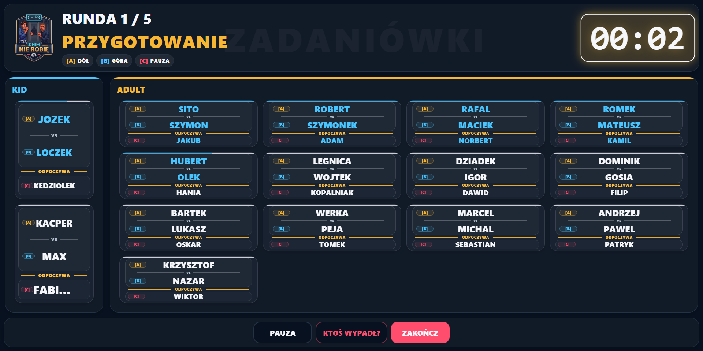
</p>

### Zadaniówki w trójkach — timer ze zmianą

Timer etapu z informacją o aktualnym kroku rotacji (**Etap 2/6 — ZMIANA!**). Pod timerem aktualny układ ról oraz **NASTĘPNA ZMIANA**, dzięki czemu nikt się nie gubi.

<p align="center">
  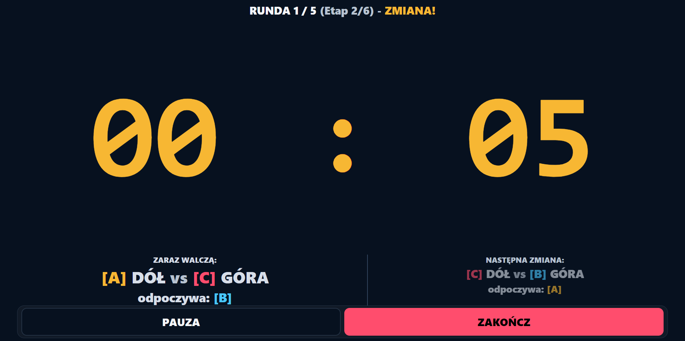
</p>

### Zadaniówki w dwójkach — przygotowanie

Pary A vs B w czytelnej siatce z oznaczeniem ról **[A]** i **[B]**. Po pierwszym etapie role się zamieniają. Bez strefy odpoczynku.

<p align="center">
  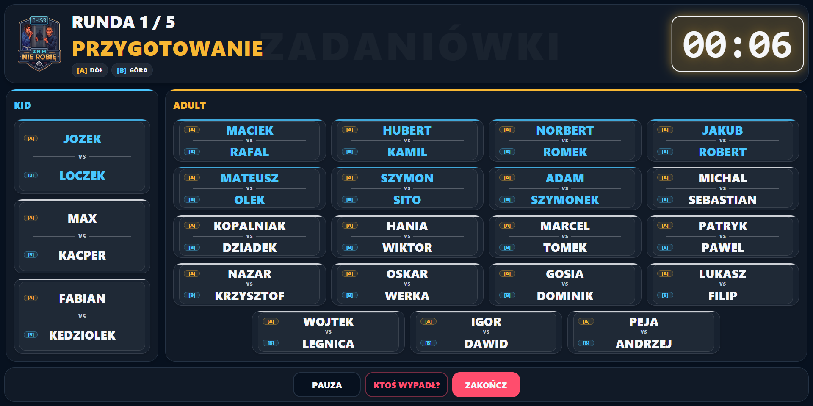
</p>

### Zadaniówki w dwójkach — timer

Timer **Etap 1/2 — PRACA**. Informacja o aktualnych rolach i nadchodzącej zamianie tuż pod timerem.

<p align="center">
  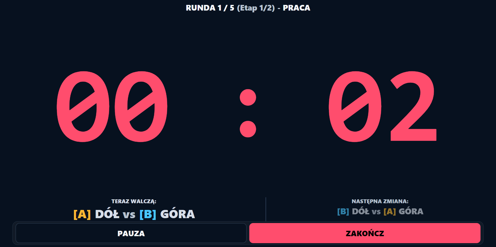
</p>

### Ktoś wypadł z treningu

W dowolnym momencie treningu można oznaczyć zawodników, którzy wypadli (kontuzja, zmęczenie, telefon). Czas się zatrzymuje, można zaznaczyć kilka osób naraz i zatwierdzić jednym kliknięciem **OK**. System przebudowuje pary na żywo — bez restartu treningu.

<p align="center">
  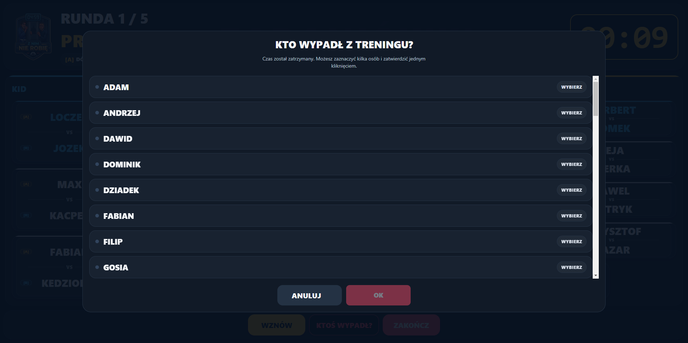
</p>

### Zawodnicy bez pauzy (VIP)

Modal z listą wszystkich zawodników jako pigułki. Tapnięcie oznacza, że ktoś **nie odpoczywa** między rundami (trener, najbardziej zaawansowani, gość specjalny). System pomija ich przy rotacji pauz.

<p align="center">
  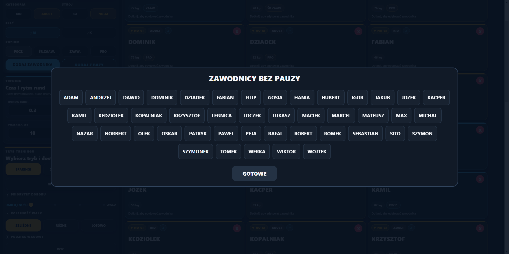
</p>

### Panel WERSJA V2

Karta informacyjna z kontaktem (e-mail), linkiem do repozytorium GitHub oraz do sklepu **mantoshop.pl**. Otwierana ikoną „i" z dolnego paska.

<p align="center">
  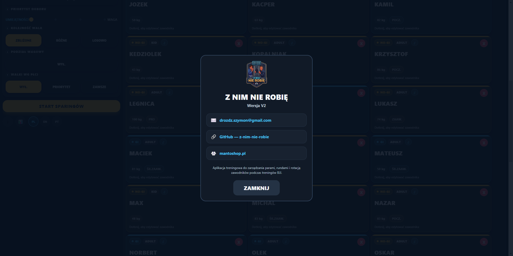
</p>

### Ekran końcowy

Po zakończeniu treningu — duże **DZIĘKUJĘ** i przycisk powrotu do menu. Krótko, czytelnie, bez ekranów-śmieci.

<p align="center">
  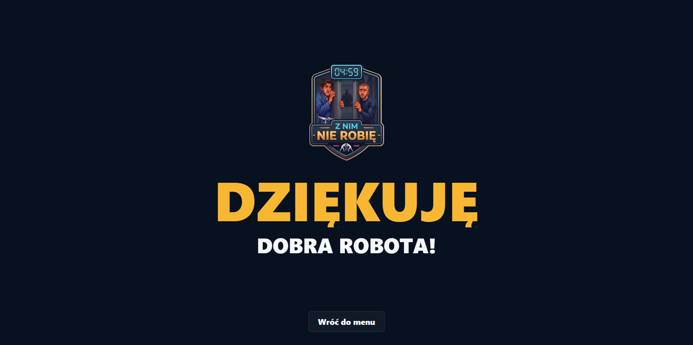
</p>

---

## Tryby treningowe

### ⚔️ Sparingi

Klasyczny tryb sparingowy. Cykl każdej rundy:

1. **Przygotowanie** — wyświetlenie par, czas na rozejście się na pozycje
2. **Praca** — duży timer, walka
3. **Przerwa** — odpoczynek, system generuje i pokazuje nowe pary na kolejną rundę

System pamięta historię spotkań i dba o to, żeby zawodnicy nie powtarzali tych samych par. Dodatkowe opcje:

- **Priorytet doboru** — suwak: UMIEJĘTNOŚCI ↔ WAGA (cztery snapy)
- **Kolejność walk** — ZBLIŻONE / RÓŻNE / LOSOWO
- **Podział wagowy** — dzieli matę na dwie grupy wagowe walczące naprzemiennie
- **Walki wg płci** — WYŁ / PRIORYTET / ZAWSZE

### 🔄 Zadaniówki w trójkach

Trzy osoby w grupie, sześć etapów na rundę — pełna rotacja. W każdym etapie dwóch walczy, trzeci odpoczywa lub asystuje:

| Etap | [A] DÓŁ | [B] GÓRA | [C] PAUZA |
|:----:|:-------:|:--------:|:---------:|
| 1 | Osoba 1 | Osoba 2 | Osoba 3 |
| 2 | Osoba 1 | Osoba 3 | Osoba 2 |
| 3 | Osoba 2 | Osoba 1 | Osoba 3 |
| 4 | Osoba 2 | Osoba 3 | Osoba 1 |
| 5 | Osoba 3 | Osoba 1 | Osoba 2 |
| 6 | Osoba 3 | Osoba 2 | Osoba 1 |

Po 6 etapach każdy walczył z każdym z obu pozycji. Czas etapu = czas rundy ÷ 6.

### 👥 Zadaniówki w dwójkach

Proste pary A vs B — dwa etapy na rundę. Po pierwszym etapie role się zamieniają (kto był na dole, idzie na górę). Czas etapu = czas rundy ÷ 2.

### 🥋 Drille

Pary dobierane **raz na cały trening** — ten sam partner do końca. Role A/B zamieniają się co rundę. Idealne do powtarzania techniki bez resetowania zaufania między partnerami co kilka minut.

---

## Silnik doboru par (Matchmaker)

Matchmaker **nie losuje** — dobiera pary algorytmicznie według priorytetów:

| Priorytet | Kryterium |
|:---------:|-----------|
| 1 | **Unikaj powtórek** — nowe pary mają pierwszeństwo, system pamięta historię spotkań |
| 2 | **Strój** — GI walczy z GI, NO-GI z NO-GI (gdy brak opcji, strój jest pomijany) |
| 3 | **Płeć** — opcjonalnie kobiety walczą najpierw ze sobą (PRIORYTET) lub tylko ze sobą (ZAWSZE) |
| 4 | **Poziom umiejętności** — zbliżony poziom (POCZ / ŚR.ZAAW / ZAAW / PRO) |
| 5 | **Waga** — zbliżona masa ciała |
| 6 | **Rotacja pauz** — sprawiedliwy podział kto odpoczywa (przy nieparzystej liczbie) |
| 7 | **Pary mieszane KID + ADULT** — tylko gdy wymaga tego liczebność grupy |

Suwak **PRIORYTET DOBORU** pozwala płynnie ważyć między umiejętnościami a wagą (4 snapy: 0 / 33 / 67 / 100). Gdy matematycznie nie da się uniknąć powtórki, system wybiera parę, która nie walczyła ze sobą najdłużej.

---

## Główne funkcje

- **Zarządzanie składem** — dodawanie, edycja i usuwanie zawodników z kafelkowego widoku
- **Baza klubowa** — szybkie dodawanie zapamiętanych zawodników z wyszukiwarką i wsadowym wyborem
- **Kategorie** — podział na KID i ADULT z osobnym matchmakingiem
- **Strój** — obsługa GI i NO-GI z priorytetem zgodności stroju
- **Poziomy** — POCZ., ŚR.ZAAW., ZAAW., PRO
- **Płeć** — M / K z opcjonalnym priorytetem walk damskich
- **Timer** — duży, czytelny zegar widoczny z kilku metrów
- **Sygnały dźwiękowe** — gong na start pracy, sygnał 10 sekund przed końcem, gong na przerwę, brawa na koniec
- **Bez pauzy (VIP)** — możliwość oznaczenia zawodników, którzy nie odpoczywają
- **Ktoś wypadł** — usunięcie zawodnika w trakcie treningu z automatycznym przeliczeniem par
- **Tryb DRILLE** — stałe pary na cały trening, rotacja ról A/B co rundę
- **Wielojęzyczność** — PL / EN / PT (BR) z wyborem przy starcie i z dolnego paska
- **Responsywny układ** — zoptymalizowany pod tablety 10.5", działa też na telefonach i w przeglądarce
- **Offline** — brak konta, brak backendu, dane zapisywane lokalnie (AsyncStorage)

---

## Stack technologiczny

| Warstwa       | Technologia                                  |
|---------------|----------------------------------------------|
| Framework     | [Expo](https://expo.dev/) + React Native     |
| Język         | TypeScript                                   |
| Routing       | Expo Router                                  |
| Dane lokalne  | AsyncStorage                                 |
| Audio         | expo-av                                      |
| Build         | EAS Build                                    |
| Web hosting   | Netlify                                      |
| Target        | Android (tablet 10.5"), iOS, przeglądarka    |

---

## Struktura projektu

```
app/
  (tabs)/
    index.tsx              # Główny UI — ekrany, timery, siatki par
    i18n.ts                # Tłumaczenia PL / EN / PT
    types.ts               # Typy domenowe (RealPlayer, Match, SparringOptions itp.)
    engine/
      matchmaker.ts        # Silnik doboru par i rotacji
assets/
  *.mp3                    # Dźwięki treningowe (gong, sygnał, brawa)
  images/                  # Ikony i splash screen
docs/
  privacy-policy.md        # Polityka prywatności
  play-store/              # Materiały do Google Play
Screenshots/               # Zrzuty ekranu (v2.0.0 Beta)
Images/                    # Logo i ikony aplikacji
plugins/                   # Pluginy Expo (np. ADI registration)
```

---

## Uruchomienie

```bash
# Instalacja zależności
npm install

# Serwer deweloperski
npx expo start

# Build APK (Android, do testów)
eas build --platform android --profile preview

# Build produkcyjny (Android, .aab)
eas build --platform android --profile production

# Export wersji webowej
npx expo export --platform web
```

---

## Wersja webowa

Aplikacja jest dostępna online pod adresem:

**https://znimnierobie.pl**

Wersja webowa działa w przeglądarce na komputerze, tablecie i telefonie. Nie wymaga instalacji.

---

## Prywatność

- Nie wymaga konta ani logowania
- Nie wysyła danych do zewnętrznych serwerów
- Nie korzysta z analityki ani trackerów
- Dane zawodników przechowywane wyłącznie lokalnie na urządzeniu

Pełna polityka prywatności: [docs/privacy-policy.md](docs/privacy-policy.md)

---

## Licencja

Wszelkie prawa zastrzeżone. Kod źródłowy udostępniony wyłącznie w celach przeglądowych.

---

<p align="center">
  <b>Z NIM NIE ROBIĘ</b> · v2.0.0 Beta · Aplikacja treningowa BJJ<br/>
  Zbudowane z 🥋 na macie i przy klawiaturze
</p>
# 🥋 Z NIM NIE ROBIĘ

<p align="center">
  
</p>

<p align="center">
  <b>Inteligentna aplikacja treningowa do prowadzenia sparingów i zadaniówek BJJ.</b><br/>
  Automatyczny dobór par · Duże timery · Rotacja w trójkach · Czytelny podgląd z dystansu
</p>

<p align="center">
  
  
  
  
  
</p>

<p align="center">
  <a href="https://znimnierobie.pl"><b>▶ Wypróbuj wersję webową</b></a>
</p>

---

## Spis treści

- [O aplikacji](#o-aplikacji)
- [Zrzuty ekranu](#zrzuty-ekranu)
- [Tryby treningowe](#tryby-treningowe)
- [Silnik doboru par (Matchmaker)](#silnik-doboru-par-matchmaker)
- [Główne funkcje](#główne-funkcje)
- [Stack technologiczny](#stack-technologiczny)
- [Struktura projektu](#struktura-projektu)
- [Uruchomienie](#uruchomienie)
- [Wersja webowa](#wersja-webowa)
- [Prywatność](#prywatność)
- [Licencja](#licencja)

---

## O aplikacji

**Z NIM NIE ROBIĘ** to narzędzie dla trenerów BJJ i grapplingu, którzy prowadzą treningi z tabletem ustawionym na ścianie lub przy macie. Zamiast kartek, stopera i ręcznego ustawiania par — jedno urządzenie robi wszystko:

- **automatycznie dobiera pary** na podstawie wagi, poziomu, stroju (GI / NO-GI) i płci,
- **pilnuje timerów** z sygnałami dźwiękowymi na przygotowanie, pracę i przerwę,
- **rotuje trójki i dwójki** w zadaniówkach z czytelnym podziałem na walczących i odpoczywającego,
- **wyświetla wszystko czytelnie** — duże fonty, mocny kontrast, czytelność z kilku metrów,
- **mówi po polsku, angielsku i portugalsku (BR)**.

Aplikacja działa offline, nie wymaga konta ani logowania. Dane zawodników zapisywane są lokalnie na urządzeniu.

---

## Zrzuty ekranu

### Ekran startowy

Pusty ekran konfiguracji — dodawanie zawodników, ustawianie czasu rund, przygotowania i przerw.

<p align="center">
  
</p>

### Skład zawodników

Zawodnicy na macie — każdy z kategorią (KID / ADULT), strojem (GI / NO-GI), wagą i poziomem zaawansowania (POCZ / ŚR.ZAAW / ZAAW / PRO). Kafelki można edytować dotknięciem.

<p align="center">
  
</p>

### Tryb zadaniówek

Po włączeniu trybu zadaniówek pojawia się wybór wariantu: **trójki** (rotacja A/B/C, sześć etapów na rundę) lub **dwójki** (zamiana ról A↔B). Przycisk startu zmienia się odpowiednio.

<p align="center">
  
</p>

### Zawodnicy bez pauzy

Modal pozwalający oznaczyć zawodników, którzy nie odpoczywają między rundami (np. trener, najbardziej zaawansowani, gość specjalny). System pomija ich przy rotacji pauz.

<p align="center">
  
</p>

### Sparingi — przygotowanie

Faza przygotowania: siatka par podzielona na sekcje **KID**, **ADULT** i **MIESZANE**. Timer odlicza czas na rozejście się na pozycje. Pary dobrane automatycznie przez silnik matchmakera.

<p align="center">
  
</p>

### Sparingi — timer pracy

Duży, czytelny timer widoczny z dystansu. Numer rundy na górze. Pauza, „ktoś wypadł?" i zakończenie pod ręką.

<p align="center">
  
</p>

### Ktoś wypadł z treningu

W dowolnym momencie treningu można oznaczyć zawodników, którzy wypadli (kontuzja, zmęczenie, telefon). System przebudowuje pary na żywo — bez konieczności restartowania całego treningu.

<p align="center">
  
</p>

### Zadaniówki w trójkach — przygotowanie

Siatka trójek z podziałem na role: **[A] DÓŁ**, **[B] GÓRA**, **[C] PAUZA / ASYSTA**. Widać kto walczy i kto odpoczywa. Sekcje KID i ADULT wyświetlane obok siebie.

<p align="center">
  
</p>

### Zadaniówki w trójkach — timer

Timer pracy z informacją o aktualnym etapie rotacji (np. etap 1/6). Pod timerem widać kto teraz walczy, kto odpoczywa i jaka będzie następna zmiana.

<p align="center">
  
</p>

### Zadaniówki w dwójkach — przygotowanie

Pary A vs B w czytelnej siatce. Role **[A]** i **[B]** zamieniają się po każdym etapie. Układ identyczny jak w trójkach, ale bez strefy odpoczynku.

<p align="center">
  
</p>

### Zadaniówki w dwójkach — timer

Timer z etapem 1/2. Informacja o aktualnych rolach i nadchodzącej zamianie.

<p align="center">
  
</p>

---

## Tryby treningowe

### ⚔️ Sparingi

Klasyczny tryb sparingowy. Cykl każdej rundy:

1. **Przygotowanie** — wyświetlenie par, czas na rozejście się na pozycje
2. **Praca** — duży timer, walka
3. **Przerwa** — odpoczynek, system generuje nowe pary na kolejną rundę

System pamięta historię spotkań i dba o to, żeby zawodnicy nie powtarzali tych samych par. Dodatkowe opcje:

- **Priorytet doboru** — suwak: UMIEJĘTNOŚCI ↔ WAGA (cztery snapy)
- **Kolejność walk** — ZBLIŻONE / RÓŻNE / LOSOWO
- **Podział wagowy** — dzieli matę na dwie grupy wagowe walczące naprzemiennie
- **Walki wg płci** — WYŁ / PRIORYTET / ZAWSZE

### 🔄 Zadaniówki w trójkach

Trzy osoby w grupie, sześć etapów na rundę — pełna rotacja. W każdym etapie dwóch walczy, trzeci odpoczywa lub asystuje:

| Etap | [A] DÓŁ | [B] GÓRA | [C] PAUZA |
|:----:|:-------:|:--------:|:---------:|
| 1 | Osoba 1 | Osoba 2 | Osoba 3 |
| 2 | Osoba 1 | Osoba 3 | Osoba 2 |
| 3 | Osoba 2 | Osoba 1 | Osoba 3 |
| 4 | Osoba 2 | Osoba 3 | Osoba 1 |
| 5 | Osoba 3 | Osoba 1 | Osoba 2 |
| 6 | Osoba 3 | Osoba 2 | Osoba 1 |

Po 6 etapach każdy walczył z każdym z obu pozycji. Czas etapu = czas rundy ÷ 6.

### 👥 Zadaniówki w dwójkach

Proste pary A vs B — dwa etapy na rundę. Po pierwszym etapie role się zamieniają (kto był na dole, idzie na górę). Czas etapu = czas rundy ÷ 2.

### 🥋 Drille

Tryb drillowy z parami dobieranymi raz na cały trening. Role A/B zamieniają się co rundę.

---

## Silnik doboru par (Matchmaker)

Matchmaker **nie losuje** — dobiera pary algorytmicznie według priorytetów:

| Priorytet | Kryterium |
|:---------:|-----------|
| 1 | **Unikaj powtórek** — nowe pary mają pierwszeństwo, system pamięta historię spotkań |
| 2 | **Strój** — GI walczy z GI, NO-GI z NO-GI (gdy brak opcji, strój jest pomijany) |
| 3 | **Płeć** — opcjonalnie kobiety walczą najpierw ze sobą (PRIORYTET) lub tylko ze sobą (ZAWSZE) |
| 4 | **Poziom umiejętności** — zbliżony poziom (POCZ / ŚR.ZAAW / ZAAW / PRO) |
| 5 | **Waga** — zbliżona masa ciała |
| 6 | **Rotacja pauz** — sprawiedliwy podział kto odpoczywa (przy nieparzystej liczbie) |
| 7 | **Pary mieszane KID + ADULT** — tylko gdy wymaga tego liczebność grupy |

Suwak **PRIORYTET DOBORU** pozwala płynnie ważyć między umiejętnościami a wagą (4 snapy: 0 / 33 / 67 / 100). Gdy matematycznie nie da się uniknąć powtórki, system wybiera parę, która nie walczyła ze sobą najdłużej.

---

## Główne funkcje

- **Zarządzanie składem** — dodawanie, edycja i usuwanie zawodników z kafelkowego widoku
- **Baza klubowa** — szybkie dodawanie zapamiętanych zawodników z wyszukiwarką
- **Kategorie** — podział na KID i ADULT z osobnym matchmakingiem
- **Strój** — obsługa GI i NO-GI z priorytetem zgodności stroju
- **Poziomy** — POCZ., ŚR.ZAAW., ZAAW., PRO
- **Płeć** — M / K z opcjonalnym priorytetem walk damskich
- **Timer** — duży, czytelny zegar widoczny z kilku metrów
- **Sygnały dźwiękowe** — gong na start pracy, sygnał 10 sekund przed końcem, gong na przerwę, brawa na koniec
- **Bez pauzy (VIP)** — możliwość oznaczenia zawodników, którzy nie odpoczywają
- **Ktoś wypadł** — usunięcie zawodnika w trakcie treningu z automatycznym przeliczeniem par
- **Statystyki** — historia treningów, frekwencja zawodników, najczęstsze pary
- **Wielojęzyczność** — PL / EN / PT (BR)
- **Responsywny układ** — zoptymalizowany pod tablety 10.5", działa też na telefonach i w przeglądarce
- **Offline** — brak konta, brak backendu, dane zapisywane lokalnie (AsyncStorage)

---

## Stack technologiczny

| Warstwa       | Technologia                                  |
|---------------|----------------------------------------------|
| Framework     | [Expo](https://expo.dev/) + React Native     |
| Język         | TypeScript                                   |
| Routing       | Expo Router                                  |
| Dane lokalne  | AsyncStorage                                 |
| Audio         | expo-av                                      |
| Build         | EAS Build                                    |
| Web hosting   | Netlify                                      |
| Target        | Android (tablet 10.5"), iOS, przeglądarka    |

---

## Struktura projektu

```
app/
  (tabs)/
    index.tsx              # Główny UI — ekrany, timery, siatki par
    i18n.ts                # Tłumaczenia PL / EN / PT
    types.ts               # Typy domenowe (RealPlayer, Match itp.)
    engine/
      matchmaker.ts        # Silnik doboru par i rotacji
assets/
  *.mp3                    # Dźwięki treningowe (gong, sygnał, brawa)
  images/                  # Ikony i splash screen
docs/
  privacy-policy.md        # Polityka prywatności
  play-store/              # Materiały do Google Play
Screenshots/               # Zrzuty ekranu
Images/                    # Logo i ikony aplikacji
plugins/                   # Pluginy Expo (np. ADI registration)
```

---

## Uruchomienie

```bash
# Instalacja zależności
npm install

# Serwer deweloperski
npx expo start

# Build APK (Android, do testów)
eas build --platform android --profile preview

# Build produkcyjny (Android, .aab)
eas build --platform android --profile production

# Export wersji webowej
npx expo export --platform web
```

---

## Wersja webowa

Aplikacja jest dostępna online pod adresem:

**https://znimnierobie.pl**

Wersja webowa działa w przeglądarce na komputerze, tablecie i telefonie. Nie wymaga instalacji.

---

## Prywatność

- Nie wymaga konta ani logowania
- Nie wysyła danych do zewnętrznych serwerów
- Nie korzysta z analityki ani trackerów
- Dane zawodników przechowywane wyłącznie lokalnie na urządzeniu

Pełna polityka prywatności: [docs/privacy-policy.md](docs/privacy-policy.md)

---

## Licencja

Wszelkie prawa zastrzeżone. Kod źródłowy udostępniony wyłącznie w celach przeglądowych.

---

<p align="center">
  <b>Z NIM NIE ROBIĘ</b> · Aplikacja treningowa BJJ<br/>
  Zbudowane z 🥋 na macie i przy klawiaturze
</p>
# 🥋 Z NIM NIE ROBIĘ

<p align="center">
  
</p>

<p align="center">
  <b>Inteligentna aplikacja treningowa do prowadzenia sparingów i zadaniówek BJJ.</b><br/>
  Automatyczny dobór par · Duże timery · Rotacja w trójkach · Czytelny podgląd z dystansu
</p>

<p align="center">
  
  
  
  
</p>

<p align="center">
  <a href="https://znimnierobie.pl"><b>▶ Wypróbuj wersję webową</b></a>
</p>

---

## Czym jest ta aplikacja?

**Z NIM NIE ROBIĘ** to narzędzie dla trenerów BJJ i grapplingu, którzy prowadzą treningi z tabletem ustawionym na ścianie lub przy macie. Zamiast kartek, stopera i ręcznego ustawiania par — jedno urządzenie robi wszystko:

- **automatycznie dobiera pary** na podstawie wagi, poziomu i stroju (GI / NO-GI),
- **pilnuje timerów** z sygnałami dźwiękowymi na przygotowanie, pracę i przerwę,
- **rotuje trójki** z czytelnym podziałem na walczących i odpoczywającego,
- **wyświetla wszystko czytelnie** — nawet z kilku metrów na dużym ekranie.

Aplikacja działa offline, nie wymaga konta ani logowania. Dane zawodników są zapisywane lokalnie na urządzeniu.

---

## Zrzuty ekranu

### Ekran startowy

Pusty ekran konfiguracji — dodawanie zawodników, ustawianie czasu rund, przygotowania i przerw.

<p align="center">
  
</p>

### Skład zawodników

26 zawodników na macie — każdy z kategorią (KID / ADULT), strojem (GI / NO-GI), wagą i poziomem zaawansowania. Kafelki można edytować dotknięciem.

<p align="center">
  
</p>

### Tryb zadaniówek

Po włączeniu trybu zadaniówek pojawiają się opcje: trójki lub dwójki. Przycisk startu zmienia się odpowiednio.

<p align="center">
  
</p>

### Zawodnicy bez pauzy

Modal pozwalający oznaczyć zawodników, którzy nie odpoczywają między rundami (np. trener, najbardziej zaawansowani). System pomija ich przy rotacji pauz.

<p align="center">
  
</p>

### Sparingi — przygotowanie

Faza przygotowania: siatka par podzielona na sekcje KID, ADULT i MIESZANE. Timer odlicza czas na rozejście się na pozycje. Pary dobrane automatycznie przez silnik matchmakera.

<p align="center">
  
</p>

### Sparingi — timer pracy

Duży, czytelny timer widoczny z dystansu. Numer rundy na górze. Pauza i zakończenie na dole.

<p align="center">
  
</p>

### Ktoś wypadł z treningu

W dowolnym momencie treningu można oznaczyć zawodników, którzy wypadli (kontuzja, zmęczenie). System przebudowuje pary na żywo bez konieczności restartowania treningu.

<p align="center">
  
</p>

### Zadaniówki w trójkach — przygotowanie

Siatka trójek z podziałem na role: **[A] DÓŁ**, **[B] GÓRA**, **[C] PAUZA**. Widać kto walczy i kto odpoczywa. Sekcje KID i ADULT wyświetlane obok siebie.

<p align="center">
  
</p>

### Zadaniówki w trójkach — timer

Timer pracy z informacją o aktualnym etapie rotacji (np. etap 1/6). Pod timerem widać kto teraz walczy, kto odpoczywa i jaka będzie następna zmiana.

<p align="center">
  
</p>

### Zadaniówki w dwójkach — przygotowanie

Pary A vs B w czytelnej siatce. Role [A] i [B] zamieniają się po każdym etapie. Układ identyczny jak w trójkach, ale bez strefy odpoczynku.

<p align="center">
  
</p>

### Zadaniówki w dwójkach — timer

Timer z etapem 1/2. Informacja o aktualnych rolach i nadchodzącej zamianie.

<p align="center">
  
</p>

---

## Tryby treningowe

### ⚔️ Sparingi

Klasyczny tryb sparingowy. Cykl każdej rundy:

1. **Przygotowanie** — wyświetlenie par, czas na rozejście się na pozycje
2. **Praca** — duży timer, walka
3. **Przerwa** — odpoczynek, system generuje nowe pary na kolejną rundę

System pamięta historię spotkań i dba o to, żeby zawodnicy nie powtarzali tych samych par. Podział na sekcje KID, ADULT i MIESZANE (gdy wymaga tego liczebność grupy).

### 🔄 Zadaniówki w trójkach

Trzy osoby w grupie, sześć etapów na rundę — pełna rotacja. W każdym etapie dwóch walczy, trzeci odpoczywa:

| Etap | [A] DÓŁ | [B] GÓRA | [C] PAUZA |
|:----:|:--------:|:--------:|:---------:|
| 1 | Osoba 1 | Osoba 2 | Osoba 3 |
| 2 | Osoba 1 | Osoba 3 | Osoba 2 |
| 3 | Osoba 2 | Osoba 1 | Osoba 3 |
| 4 | Osoba 2 | Osoba 3 | Osoba 1 |
| 5 | Osoba 3 | Osoba 1 | Osoba 2 |
| 6 | Osoba 3 | Osoba 2 | Osoba 1 |

Po 6 etapach każdy walczył z każdym z obu pozycji. Czas etapu = czas rundy ÷ 6.

### 👥 Zadaniówki w dwójkach

Proste pary A vs B — dwa etapy na rundę. Po pierwszym etapie role się zamieniają (kto był na dole, idzie na górę). Czas etapu = czas rundy ÷ 2.

---

## Silnik doboru par (Matchmaker)

Matchmaker **nie losuje** — dobiera pary algorytmicznie według priorytetów:

| Priorytet | Kryterium |
|:---------:|-----------|
| 1 | **Unikaj powtórek** — nowe pary mają pierwszeństwo, system pamięta historię spotkań |
| 2 | **Strój** — GI walczy z GI, NO-GI z NO-GI (gdy brak opcji, strój jest pomijany) |
| 3 | **Poziom** — zbliżony poziom umiejętności (POCZ / ŚR.ZAAW / ZAAW / PRO) |
| 4 | **Waga** — zbliżona masa ciała |
| 5 | **Rotacja pauz** — sprawiedliwy podział kto odpoczywa (przy nieparzystej liczbie) |
| 6 | **Pary mieszane** — KID + ADULT tylko gdy wymaga tego liczebność grupy |

Gdy matematycznie nie da się uniknąć powtórki, system wybiera parę, która nie walczyła ze sobą najdłużej.

---

## Główne funkcje

- **Zarządzanie składem** — dodawanie, edycja i usuwanie zawodników z kafelkowego widoku
- **Kategorie** — podział na KID i ADULT z osobnym matchmakingiem
- **Strój** — obsługa GI i NO-GI z priorytetem zgodności stroju
- **Poziomy** — POCZ., ŚR.ZAAW., ZAAW., PRO
- **Timer** — duży, czytelny zegar widoczny z kilku metrów
- **Sygnały dźwiękowe** — gong na start pracy, sygnał 10 sekund przed końcem, gong na przerwę
- **Bez pauzy** — możliwość oznaczenia zawodników, którzy nie odpoczywają
- **Ktoś wypadł** — usunięcie zawodnika w trakcie treningu z automatycznym przeliczeniem par
- **Responsywny układ** — zoptymalizowany pod tablety 10.5", ale działa też na telefonach i w przeglądarce
- **Offline** — brak konta, brak backendu, dane zapisywane lokalnie (AsyncStorage)

---

## Stack technologiczny

| Warstwa | Technologia |
|---------|-------------|
| Framework | [Expo](https://expo.dev/) + React Native |
| Język | TypeScript |
| Routing | Expo Router |
| Dane lokalne | AsyncStorage |
| Audio | expo-av |
| Build | EAS Build |
| Web | Netlify |
| Target | Android (tablet 10.5"), iOS, przeglądarka |

---

## Struktura projektu

```
app/
  (tabs)/
    index.tsx              # Główny UI — ekrany, timery, siatki par
    engine/
      matchmaker.ts        # Silnik doboru par i rotacji
    types.ts               # Typy domenowe (RealPlayer, Match itp.)
assets/
  *.mp3                    # Dźwięki treningowe (gong, sygnał, brawa)
  images/                  # Ikony i splash screen
docs/
  screenshots/             # Zrzuty ekranu
```

---

## Uruchomienie

```bash
# Instalacja zależności
npm install

# Serwer deweloperski
npx expo start

# Build APK (Android, do testów)
eas build --platform android --profile preview

# Build produkcyjny (Android)
eas build --platform android --profile production

# Export wersji webowej
npx expo export --platform web
```

---

## Wersja webowa

Aplikacja jest dostępna online pod adresem:

**https://znimnierobie.pl**

Wersja webowa działa w przeglądarce na komputerze, tablecie i telefonie. Nie wymaga instalacji.

---

## Prywatność

- Nie wymaga konta ani logowania
- Nie wysyła danych do zewnętrznych serwerów
- Nie korzysta z analityki ani trackerów
- Dane zawodników przechowywane wyłącznie lokalnie na urządzeniu

---

## Licencja

Wszelkie prawa zastrzeżone. Kod źródłowy udostępniony wyłącznie w celach przeglądowych.

---

<p align="center">
  <b>Z NIM NIE ROBIĘ</b> · Aplikacja treningowa BJJ<br/>
  Zbudowane z 🥋 na macie i przy klawiaturze
</p>
