# 🥋 Z NIM NIE ROBIĘ

<p align="center">
  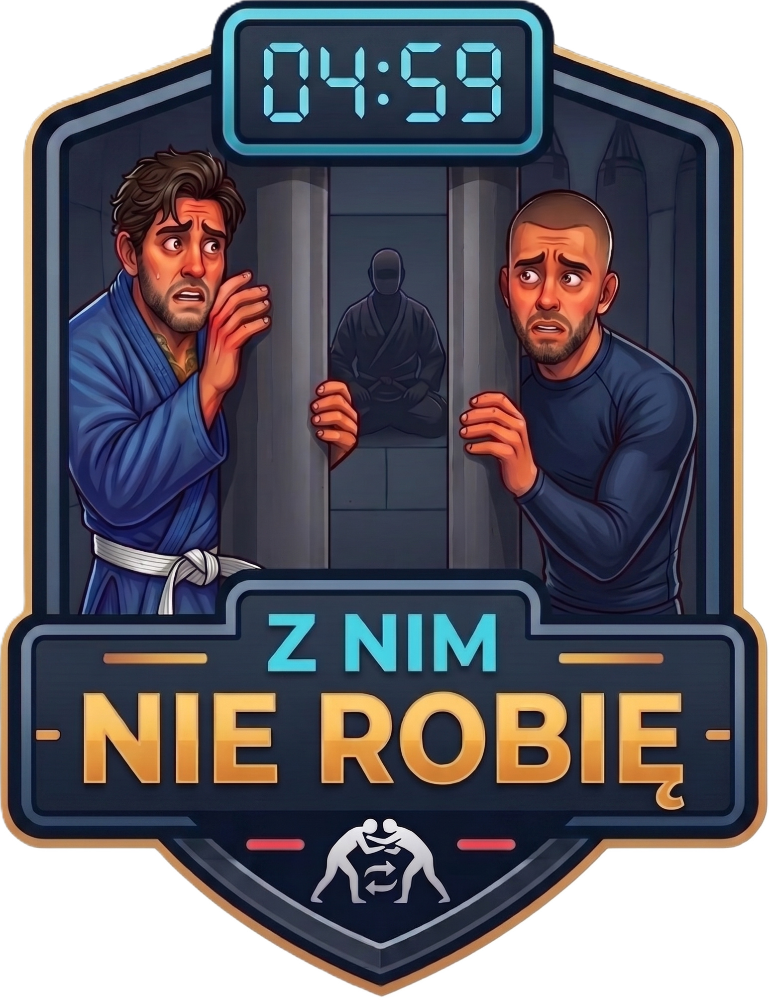
</p>

<p align="center">
  <b>Aplicativo inteligente de treino para conduzir sparring, task drills e drills técnicos de BJJ.</b><br/>
  Formação automática de pares · Cronômetros grandes · Rotação em trios · Visível à distância
</p>

<p align="center">
  
  
  
  
  
</p>

<p align="center">
  <a href="https://znimnierobie.pl"><b>▶ Experimente a versão web</b></a>
</p>

<p align="center">
  
</p>

<p align="center">
  <a href="README.md">🇵🇱 Polski</a> · <a href="README.en.md">🇬🇧 English</a> · <b>🇧🇷 Português (BR)</b>
</p>

---

## Sumário

- [Novidades na v2.0.5 Production](#novidades-na-v205-production)
- [Sobre o app](#sobre-o-app)
- [Capturas de tela](#capturas-de-tela)
- [Modos de treino](#modos-de-treino)
- [Motor de formação de pares](#motor-de-formação-de-pares)
- [Funcionalidades principais](#funcionalidades-principais)
- [Stack tecnológico](#stack-tecnológico)
- [Estrutura do projeto](#estrutura-do-projeto)
- [Executando](#executando)
- [Versão web](#versão-web)
- [Privacidade](#privacidade)
- [Licença](#licença)

---

## Novidades na v2.0.5 Production

### 🎉 Lançamento de produção (v2.0.5)

Primeira versão aceita pelo **Google Play**. Disponível no Android em 3 idiomas (PL / EN / PT-BR).

### 🎨 Tela de configurações renovada (v2.0.5)

A tela inicial (adicionar lutadores, tempo de round, modo de treino) foi renovada — agora parece mais tranquila, profissional e menos apertada.

- **Fontes mais finas e legíveis** — fim do agressivo `weight: 900` em todo lugar. Cabeçalhos e rótulos usam agora pesos mais leves (500/600) que respiram melhor.
- **Mais espaço entre seções** — paddings maiores, margens maiores entre grupos de campos.
- **Botões planos e limpos** — removidas bordas e sombras pesadas dos botões SPARRING / TASK DRILLS / DRILLS, cards de tempo (ROUND / PREP / INTERVALO / ROUNDS), campos de texto. Visual consistente no estilo “Apple/iOS minimal”.
- **Botão VISITANTE redesenhado** — agora parece e funciona como os outros toggles (M/F, ADULT/KID, GI/NO-GI). Toque para alternar, fica roxo quando ativo — sem aquele marcador circular estranho.
- **Pílulas mais sutis** — badges de tipo de lutador (ADULT, NO-GI, ♂/♀) não têm mais sombras, ficaram mais tranquilas.

### 🐛 Corrigido (v2.0.5)

- **Bug de rotação de tela** — após mudar orientação portrait → landscape (ou voltar), a tela de configurações às vezes ficava rolada “além do fim”. Agora o ScrollView externo volta automaticamente para o topo a cada mudança de orientação.

### ✈ Visitantes de outro clube (v2.0.4)

- **Botão `VISITANTE` na ficha do lutador** — pequeno toggle abaixo do apelido (`○ VISITANTE` / `✈ VISITANTE`).
- **O motor evita pares VISITANTE–VISITANTE** quase tão duramente quanto repetições — prioridade acima de traje, peso e nível; quebrado apenas quando não existe alternativa matemática.
- **Status por treino** — não é salvo no banco do clube; marque os visitantes no início de cada sessão.
- **Ícone roxo ✈** antes do apelido nos cards do elenco — mostra na hora quem é visitante.

### 🔴 Correção crítica (v2.0.3)

- **A lista de descanso não desaparece mais da barra superior durante a fase "INTERVALO"** — após marcar alguém como "FORA", o número de ativos ficava ímpar e o algoritmo corretamente colocava alguém para descansar, mas a dica só aparecia na fase PREP. Agora a lista "QUEM DESCANSA" é visível **em ambas as fases (PREP e INTERVALO)**.

### 🔴 Correção crítica (v2.0.2)

- **A tela não desliga mais durante o cronômetro** — `useKeepAwake` movido para o root layout + chamada explícita de `activateKeepAwakeAsync`. O tablet montado na parede não apaga durante sparring nem drills.

### 🟢 Destaques do ciclo 2.0.x Beta

- **Tela PREP unificada** — fim das colunas separadas KID / ADULT / DESCANSO. Todos os pares em um único grid denso com **cores por categoria** e **legenda na barra superior**:
  - 🟦 **KID GI** (azul)
  - 🩵 **KID NO-GI** (ciano)
  - 🟧 **ADULT GI** (laranja)
  - 🟥 **ADULT NO-GI** (vermelho)
  - 🟪 **MISTO** (gradiente — KID + ADULT)
- **Regra GI para o par** — um par conta como GI apenas se **ambos** estiverem de GI; basta um NO-GI para o par inteiro virar NO-GI
- **DESCANSO inline ao lado de PREP** — quem descansa aparece ao lado do cabeçalho da fase em vez de uma coluna separada (mais espaço para os blocos de pares)
- **Saída de lutadores em dois modos** — no modal "QUEM SAIU?" cada pessoa tem dois botões:
  - **FORA** — removido do resto do treino
  - **DESCANSA 1 ROUND** — volta automaticamente no próximo round

### 🟢 Funcionalidades base da 2.0.0 Beta

- **Seletor de idioma na inicialização** — PL / EN / PT (BR) visível desde a primeira execução
- **Três modos de treino** — SPARRING · TASK DRILLS (TRIOS / DUPLAS) · **DRILLS** (modo completo com pares fixos e troca de papéis A/B a cada round)
- **Campo gênero (M / F)** no cartão do lutador e **Lutas por gênero** nas opções de sparring (DESL / PRIORIDADE / SEMPRE)
- **Slider de prioridade** — HABILIDADE ↔ PESO (4 snaps)
- **Divisão por peso** — opcionalmente divide o tatame em dois grupos de peso
- **Ordem das lutas** — SEMELHANTES / DIFERENTES / ALEATÓRIO
- **Sem pausa (VIP)** em layout limpo de pílulas com nomes
- **Tela final "OBRIGADO — BOM TRABALHO!"** com retorno ao menu
- **Painel VERSÃO V2** — contato, link para GitHub e loja, breve descrição
- **Cards de trios e duplas otimizados** para tablets de 10,5" — sem rolagem nas resoluções típicas

---

## Sobre o app

**Z NIM NIE ROBIĘ** ("Não rolo com ele") é uma ferramenta para professores de BJJ e grappling que conduzem aulas com um tablet montado na parede ou ao lado do tatame. Em vez de papel, cronômetro e organização manual de pares — um único dispositivo faz tudo:

- **forma pares automaticamente** com base em peso, nível, kimono (GI / NO-GI) e gênero,
- **controla os timers** com sinais sonoros para preparação, trabalho e descanso,
- **roda trios e duplas** nos task drills com divisão clara entre quem luta e quem descansa,
- **conduz drills** com pares formados uma vez por aula e troca de papéis A/B a cada round,
- **mostra tudo de forma legível** — fontes grandes, alto contraste, visível a vários metros,
- **fala polonês, inglês e português brasileiro**.

O app funciona offline, não exige conta nem login. Dados dos lutadores são salvos localmente no dispositivo.

---

## Capturas de tela

### Seletor de idioma

Primeira inicialização — escolha rápida do idioma da interface. O app pode ser alternado entre **PL / EN / PT** a qualquer momento pela barra inferior.

<p align="center">
  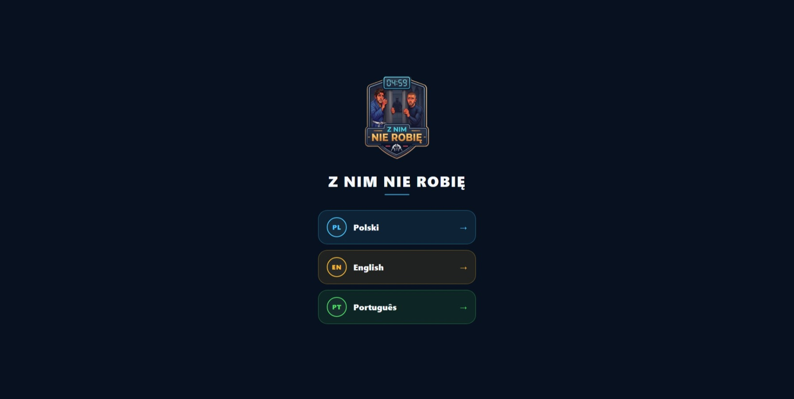
</p>

### Tela inicial (tatame vazio)

Configuração do treino: adicionar lutadores (painel esquerdo), tempo e ritmo dos rounds, modo de treino e opções do matchmaker. À direita ficam os blocos dos lutadores.

<p align="center">
  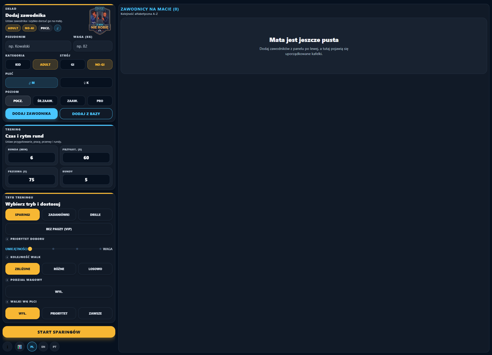
</p>

### Editar lutador

Ficha completa do lutador: apelido, peso, categoria (KID / ADULT), kimono (GI / NO-GI), gênero (M / F) e nível (INICIANTE / INTERMEDIÁRIO / AVANÇADO / PRO). Tocar em um card abre o mesmo formulário para edição.

<p align="center">
  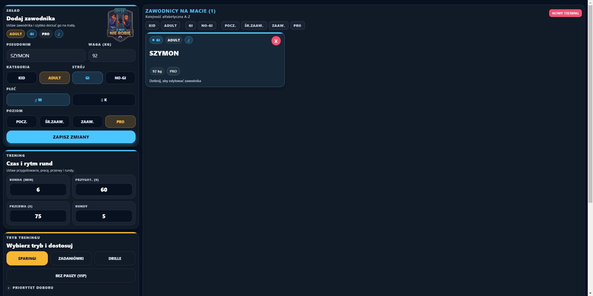
</p>

### Banco do clube — busca

Modal **BANCO DO CLUBE** com a lista de lutadores salvos. Busca por nome, adição individual com **SELECIONAR**.

<p align="center">
  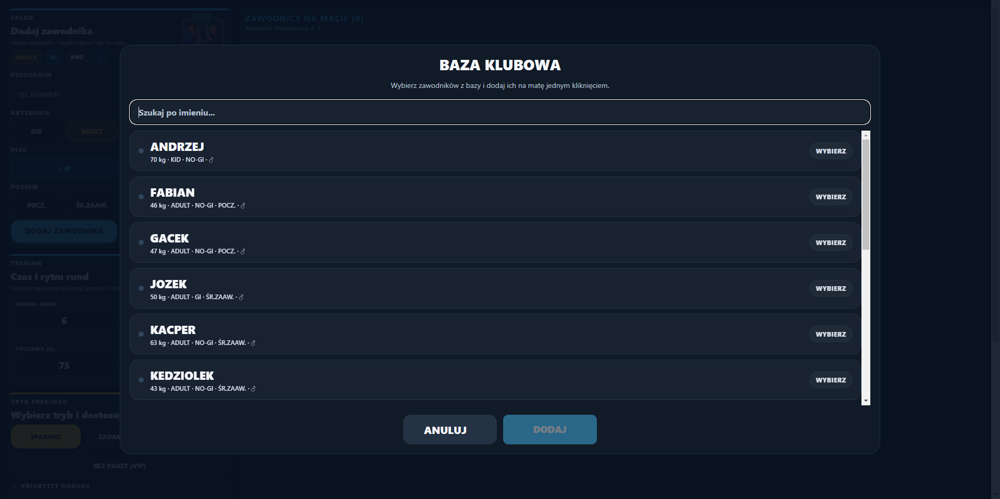
</p>

### Banco do clube — adição em lote

Marque várias pessoas de uma vez e adicione todas ao tatame com um único clique em **ADICIONAR (n)**. Os blocos selecionados ficam azuis.

<p align="center">
  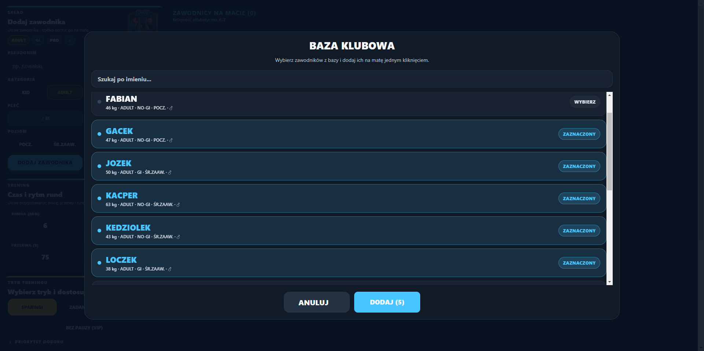
</p>

### Lutadores no tatame

Lutadores ordenados alfabeticamente com filtros no topo (KID / ADULT / GI / NO-GI / nível). Cada card mostra kimono, categoria, gênero, peso e nível. O “×” vermelho remove, tocar edita.

<p align="center">
  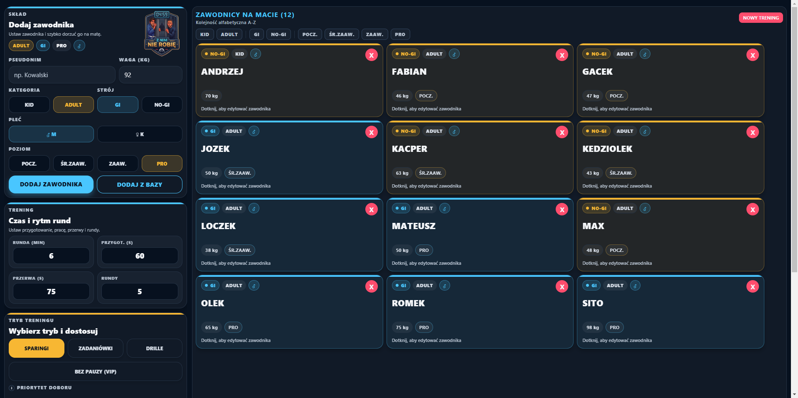
</p>

### Modo SPARRING

Sparring clássico com painel completo de opções: **SEM PAUSA (VIP)**, **PRIORIDADE DE FORMAÇÃO** (slider HABILIDADE ↔ PESO), **ORDEM DAS LUTAS** (SEMELHANTES / DIFERENTES / ALEATÓRIO), **DIVISÃO POR PESO** e **LUTAS POR GÊNERO** (DESL / PRIORIDADE / SEMPRE).

<p align="center">
  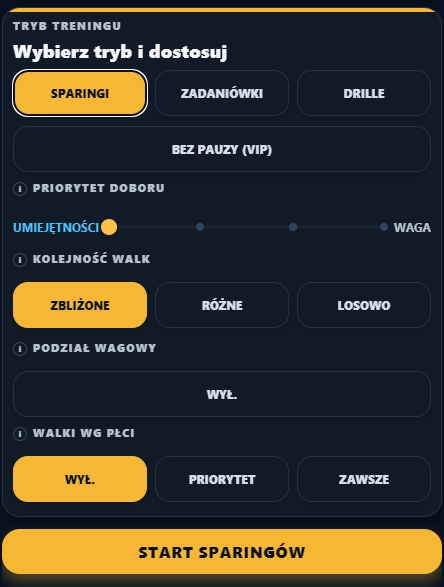
</p>

### Modo TASK DRILLS (trios / duplas)

Ao escolher task drills, aparece o seletor **TRIOS / DUPLAS**. O texto do botão de início muda conforme (`INICIAR TASK DRILLS (TRIOS)` / `(DUPLAS)`).

<p align="center">
  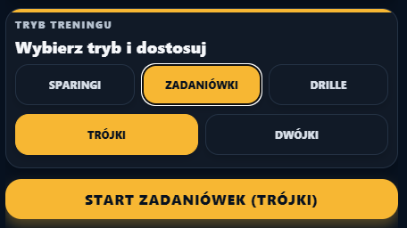
</p>

### Modo DRILLS

Pares formados **uma vez por treino inteiro**, papéis A/B trocam a cada round. Ideal para repetir técnica com o mesmo parceiro.

<p align="center">
  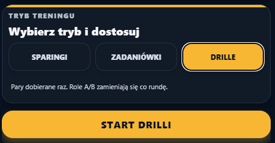
</p>

### Sparring — preparação

Fase **PREP** do round 1/5: grade de pares dividida em seções **KID**, **ADULT** e **MISTO**. Cronômetro conta o tempo para se posicionar. Pares formados pelo motor matchmaker.

<p align="center">
  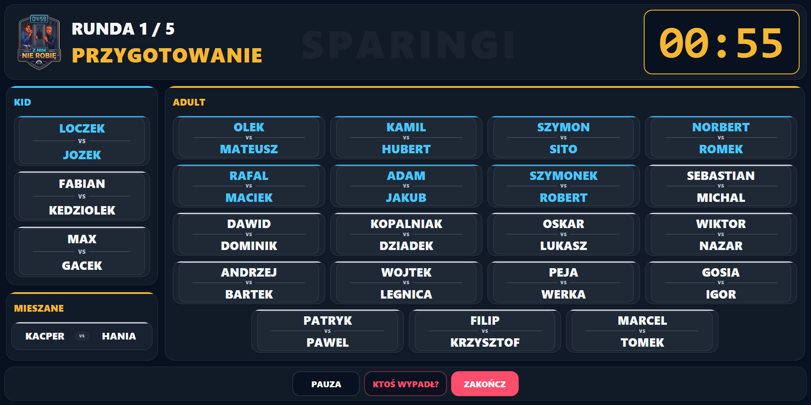
</p>

### Sparring — cronômetro de trabalho

Cronômetro grande e legível, visível à distância. Número do round em cima. Botões **PAUSAR** e **ENCERRAR** ao alcance.

<p align="center">
  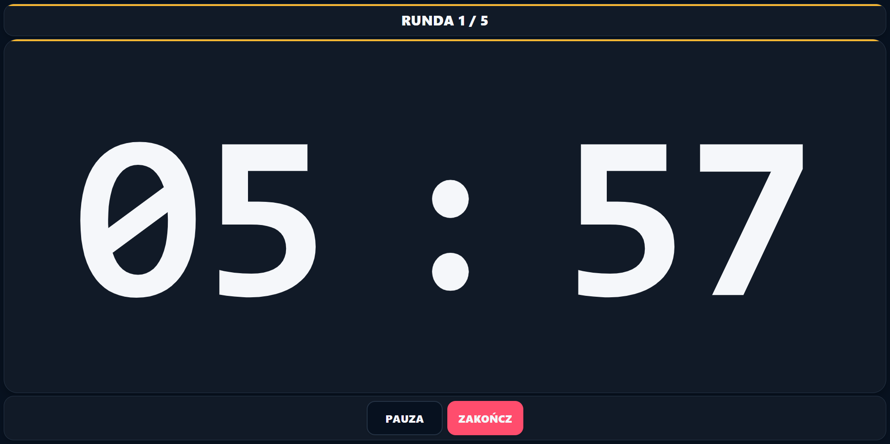
</p>

### Sparring — intervalo com próximos pares

Fase **INTERVALO** do round 2/5: a tela já mostra a próxima formação de pares. O professor pode discutir o que melhorar antes do próximo gongo.

<p align="center">
  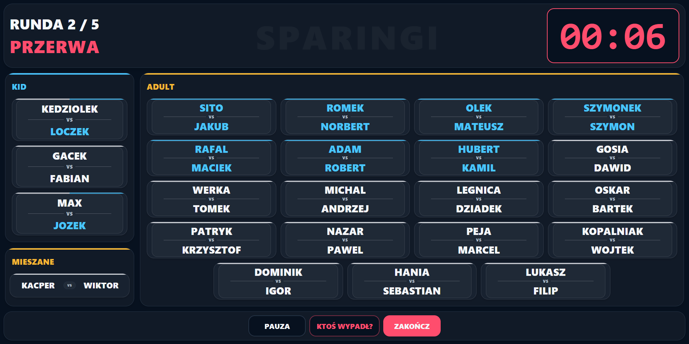
</p>

### Task drills em trios — preparação

Grade de trios com divisão por papel: **[A] EMBAIXO**, **[B] EM CIMA**, **[C] DESCANSO / AUXÍLIO**. Seções KID e ADULT lado a lado, legível mesmo do outro lado da sala.

<p align="center">
  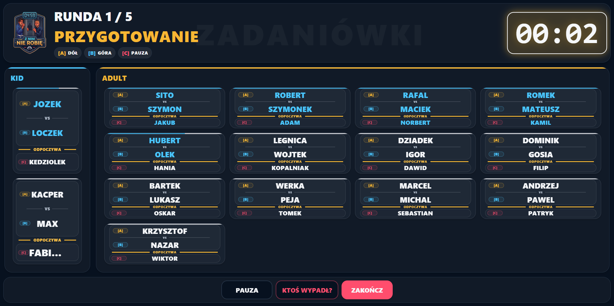
</p>

### Task drills em trios — cronômetro com troca

Cronômetro de etapa com o passo atual da rotação (**Etapa 2/6 — TROCAR!**). Abaixo do cronômetro: papéis atuais e **PRÓXIMA TROCA**, para que ninguém se perca.

<p align="center">
  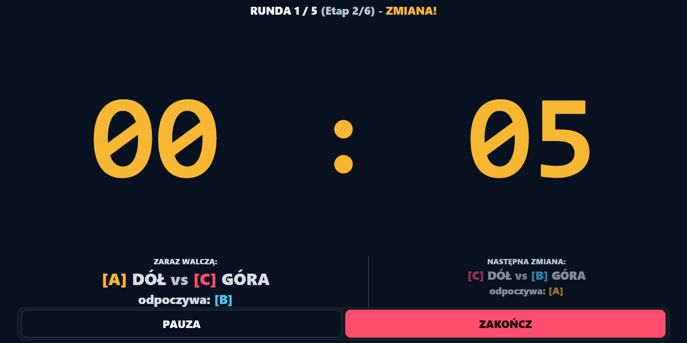
</p>

### Task drills em duplas — preparação

Pares A vs B em uma grade limpa com rótulos **[A]** e **[B]**. Após a primeira etapa, os papéis se invertem. Sem zona de descanso.

<p align="center">
  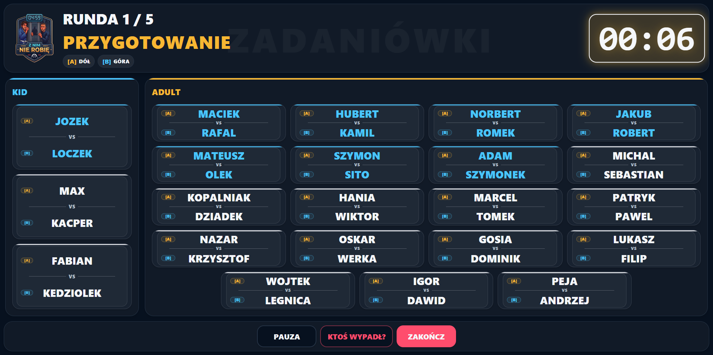
</p>

### Task drills em duplas — cronômetro

Cronômetro **Etapa 1/2 — TRABALHO**. Papéis atuais e próxima troca exibidos logo abaixo do cronômetro.

<p align="center">
  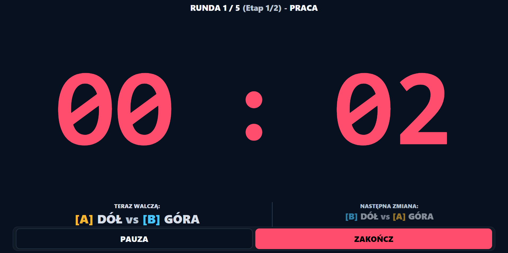
</p>

### Alguém saiu do treino

A qualquer momento do treino você pode marcar lutadores que saíram (lesão, cansaço, telefone). O cronômetro pausa, dá para marcar várias pessoas e confirmar com um único **OK**. O sistema refaz os pares na hora — sem reiniciar o treino.

<p align="center">
  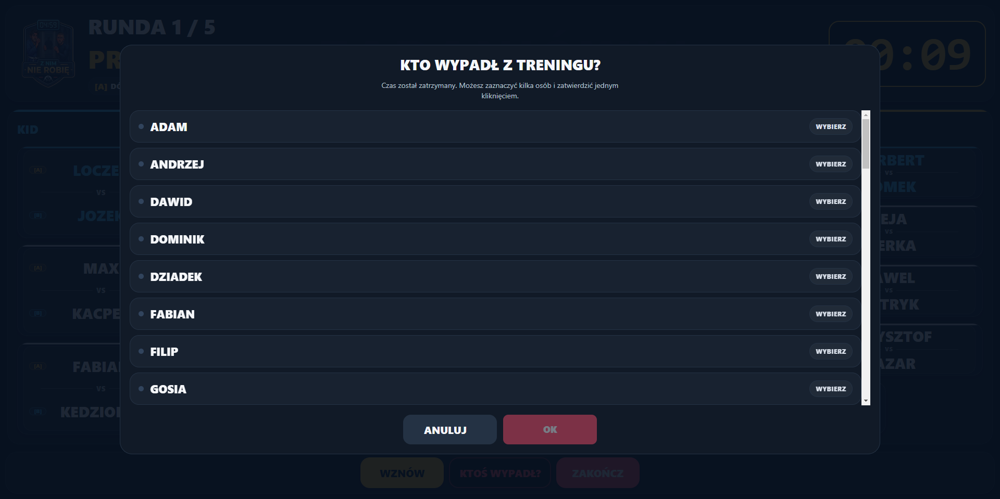
</p>

### Lutadores sem pausa (VIP)

Modal com todos os lutadores como pílulas. Um toque marca quem **não descansa** entre os rounds (o professor, os mais avançados, um convidado especial). O sistema os ignora na rotação de pausa.

<p align="center">
  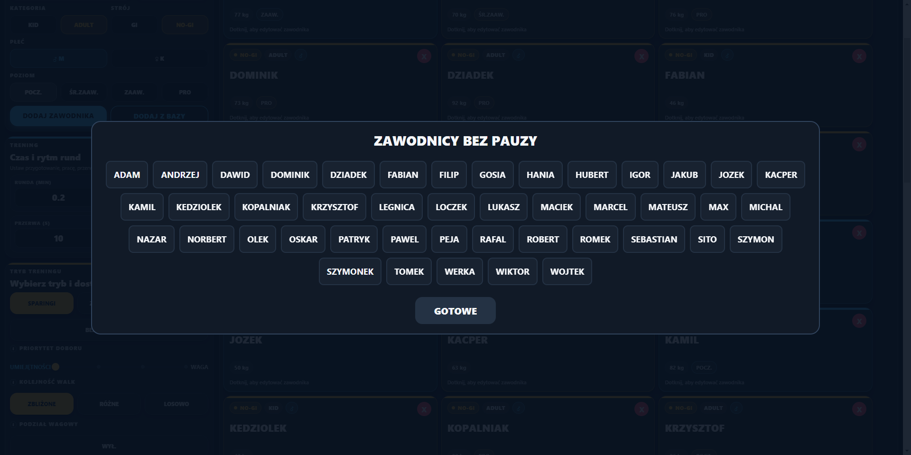
</p>

### Painel VERSÃO V2

Card informativo com contato (e-mail), link para o repositório GitHub e para a loja **mantoshop.pl**. Aberto pelo ícone “i” na barra inferior.

<p align="center">
  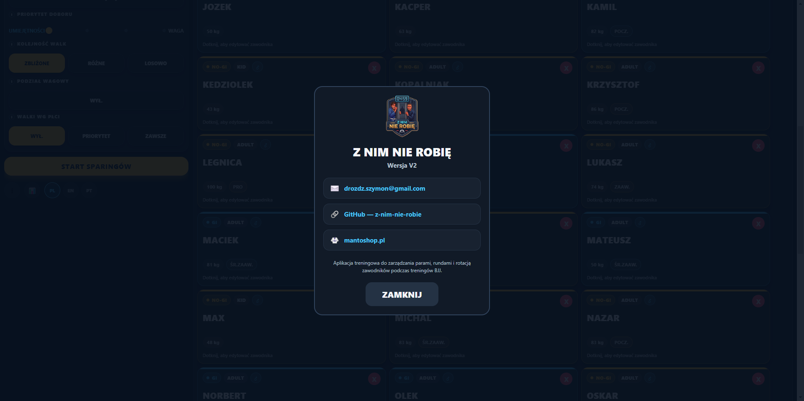
</p>

### Tela final

Após o treino terminar — um grande **OBRIGADO** e um botão para voltar ao menu. Curto, legível, sem telas de lixo.

<p align="center">
  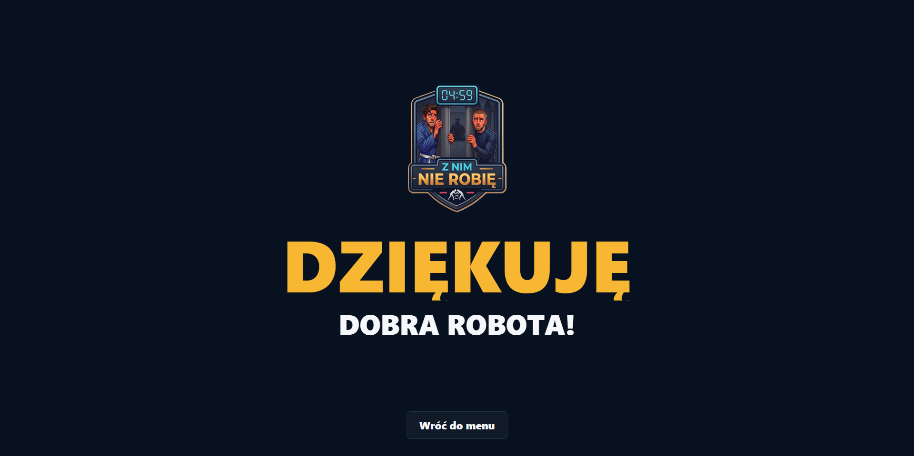
</p>

---

## Modos de treino

### ⚔️ Sparring

Modo clássico de sparring. Ciclo de cada round:

1. **Preparação** — exibição dos pares, tempo para se posicionar
2. **Trabalho** — cronômetro grande, luta
3. **Descanso** — recuperação; o sistema gera e mostra novos pares para o próximo round

O sistema lembra o histórico de lutas e evita repetir os mesmos pares. Opções extras:

- **Prioridade de formação** — slider: HABILIDADE ↔ PESO (quatro snaps)
- **Ordem das lutas** — SEMELHANTES / DIFERENTES / ALEATÓRIO
- **Divisão por peso** — divide o tatame em dois grupos de peso alternados
- **Lutas por gênero** — DESL / PRIORIDADE / SEMPRE

### 🔄 Task drills em trios

Grupos de três pessoas, seis etapas por round — rotação completa. Em cada etapa dois lutam, o terceiro descansa ou auxilia:

| Etapa | [A] EMBAIXO | [B] EM CIMA | [C] DESCANSO |
|:-----:|:-----------:|:-----------:|:------------:|
| 1     | Pessoa 1    | Pessoa 2    | Pessoa 3     |
| 2     | Pessoa 1    | Pessoa 3    | Pessoa 2     |
| 3     | Pessoa 2    | Pessoa 1    | Pessoa 3     |
| 4     | Pessoa 2    | Pessoa 3    | Pessoa 1     |
| 5     | Pessoa 3    | Pessoa 1    | Pessoa 2     |
| 6     | Pessoa 3    | Pessoa 2    | Pessoa 1     |

Após 6 etapas todos lutaram com todos das duas posições. Tempo de etapa = tempo do round ÷ 6.

### 👥 Task drills em duplas

Pares simples A vs B — duas etapas por round. Após a primeira etapa os papéis se invertem (quem estava embaixo vai para cima). Tempo de etapa = tempo do round ÷ 2.

### 🥋 Drills

Pares formados **uma vez por aula** — mesmo parceiro até o fim. Os papéis A/B trocam a cada round. Ideal para repetir técnica sem resetar a confiança entre parceiros a cada poucos minutos.

---

## Motor de formação de pares

O matchmaker **não sorteia** — escolhe os pares por algoritmo, segundo prioridades:

| Prioridade | Critério |
|:----------:|----------|
| 1 | **Evitar repetições** — pares novos têm preferência; o sistema lembra o histórico |
| 2 | **Kimono** — GI luta com GI, NO-GI com NO-GI (quando a opção está desligada, ignora) |
| 3 | **Gênero** — opcionalmente mulheres lutam primeiro entre si (PRIORIDADE) ou só entre si (SEMPRE) |
| 4 | **Nível de habilidade** — níveis próximos (INI / INT / AVAN / PRO) |
| 5 | **Peso** — massa corporal próxima |
| 6 | **Rotação de descanso** — distribuição justa de quem descansa (com nº ímpar) |
| 7 | **Pares mistos KID + ADULT** — apenas quando o tamanho do grupo exige |

O slider **PRIORIDADE DE FORMAÇÃO** permite balancear suavemente habilidade vs peso (4 snaps: 0 / 33 / 67 / 100). Quando matematicamente é impossível evitar uma repetição, o sistema escolhe o par que não luta há mais tempo.

---

## Funcionalidades principais

- **Gestão de elenco** — adicionar, editar e remover lutadores em vista de blocos
- **Base do clube** — adição rápida de lutadores salvos com busca e seleção em lote
- **Categorias** — divisão KID e ADULT com matchmaking separado
- **GI / NO-GI** — ambos suportados com prioridade de combinação
- **Níveis** — INI, INT, AVAN, PRO
- **Gênero** — M / F com prioridade opcional para lutas femininas
- **Cronômetro** — grande, legível a vários metros
- **Sinais sonoros** — gongo no início do trabalho, aviso de 10 s, gongo no descanso, aplausos no fim
- **Sem pausa (VIP)** — marcar lutadores que não descansam entre rounds
- **Lutador saiu** — remover lutador no meio da aula com recálculo automático dos pares; **dois modos**: FORA (removido) ou DESCANSA 1 ROUND (volta no próximo round)
- **Modo DRILLS** — pares fixos por toda a aula, troca de papéis A/B a cada round
- **Multilíngue** — PL / EN / PT (BR) com seletor na inicialização e na barra inferior
- **Layout responsivo** — otimizado para tablets de 10,5", funciona em celulares e navegadores
- **Offline** — sem conta, sem backend, dados salvos localmente (AsyncStorage)

---

## Stack tecnológico

| Camada         | Tecnologia                                  |
|----------------|---------------------------------------------|
| Framework      | [Expo](https://expo.dev/) + React Native    |
| Linguagem      | TypeScript                                  |
| Roteamento     | Expo Router                                 |
| Dados locais   | AsyncStorage                                |
| Áudio          | expo-av                                     |
| Build          | EAS Build                                   |
| Hospedagem web | Netlify                                     |
| Alvo           | Android (tablet 10,5"), iOS, navegador      |

---

## Estrutura do projeto

```
app/
  (tabs)/
    index.tsx              # UI principal — telas, timers, grids de pares
    i18n.ts                # Traduções PL / EN / PT
    types.ts               # Tipos de domínio (RealPlayer, Match, SparringOptions, etc.)
    engine/
      matchmaker.ts        # Motor de formação e rotação de pares
assets/
  *.mp3                    # Sons de treino (gongo, aviso, aplausos)
  images/                  # Ícones e splash
docs/
  privacy-policy.md        # Política de privacidade
  play-store/              # Materiais para Google Play
Screenshots/               # Capturas de tela (v2.0.4 Beta)
Images/                    # Logo e ícones do app
plugins/                   # Plugins do Expo (ex.: ADI registration)
```

---

## Executando

```bash
# Instalar dependências
npm install

# Servidor de desenvolvimento
npx expo start

# Build APK (Android, para testes)
eas build --platform android --profile preview

# Build de produção (Android, .aab)
eas build --platform android --profile production

# Exportar versão web
npx expo export --platform web
```

---

## Versão web

O app está disponível online em:

**https://znimnierobie.pl**

A versão web roda no navegador em desktop, tablet e celular. Não requer instalação.

---

## Privacidade

- Não exige conta nem login
- Não envia dados para servidores externos
- Não usa analytics nem trackers
- Dados dos lutadores salvos apenas localmente no dispositivo

Política de privacidade completa: [docs/privacy-policy.md](docs/privacy-policy.md)

---

## Licença

Todos os direitos reservados. Código-fonte publicado apenas para fins de revisão.

---

<p align="center">
  <b>Z NIM NIE ROBIĘ</b> · v2.0.4 Beta · App de treino BJJ<br/>
  Construído com 🥋 no tatame e no teclado
</p>
